# Diagram Architektury Autentykacji - Foodnager

## Przegląd

Ten diagram przedstawia kompleksową architekturę modułu autentykacji dla aplikacji Foodnager, zgodnie z wymaganiami PRD (US-001) i specyfikacją techniczną.

## Legenda Kolorów

- 🟢 **Zielony** - Nowe komponenty do implementacji
- 🟡 **Żółty** - Komponenty do modyfikacji
- ⚪ **Szary** - Istniejące komponenty/infrastruktura

## Diagram Mermaid

```mermaid
flowchart TD
    subgraph "Strony Publiczne - Auth"
        LOGIN["login.astro<br/>REFAKTOR"]
        REGISTER["register.astro<br/>REFAKTOR"]
        FORGOT["forgot-password.astro<br/>NOWY"]
        RESET["reset-password.astro<br/>NOWY"]
    end

    subgraph "Strony Chronione"
        PROFILE["profile.astro<br/>NOWY"]
        FRIDGE["fridge.astro<br/>MODYFIKACJA"]
        RECIPES["recipes.astro<br/>MODYFIKACJA"]
        HISTORY["history.astro<br/>MODYFIKACJA"]
    end

    subgraph "Layouts"
        AUTHLAYOUT["AuthLayout.astro<br/>NOWY<br/>Fullscreen, bez nawigacji"]
        MAINLAYOUT["Layout.astro<br/>MODYFIKACJA<br/>+ user props"]
    end

    subgraph "Komponenty Auth - React"
        LOGINFORM["LoginForm.tsx<br/>NOWY"]
        REGISTERFORM["RegisterForm.tsx<br/>NOWY"]
        FORGOTFORM["ForgotPasswordForm.tsx<br/>NOWY"]
        RESETFORM["ResetPasswordForm.tsx<br/>NOWY"]
    end

    subgraph "Komponenty Profilu - React"
        PROFILEVIEW["ProfileView.tsx<br/>NOWY"]
        USERINFOCARD["UserInfoCard.tsx<br/>NOWY"]
        LOGOUTBTN["LogoutButton.tsx<br/>NOWY"]
    end

    subgraph "Komponenty Nawigacji"
        USERINFODISPLAY["UserInfoDisplay.tsx<br/>NOWY<br/>Avatar, email, wyloguj"]
        SIDEBAR["Sidebar.astro<br/>MODYFIKACJA<br/>+ sekcja user"]
        BOTTOMNAV["BottomNavigation.astro<br/>MODYFIKACJA<br/>/login → /profile"]
    end

    subgraph "API Endpoints"
        API_LOGIN["/api/auth/login.ts<br/>POST"]
        API_REGISTER["/api/auth/register.ts<br/>POST"]
        API_LOGOUT["/api/auth/logout.ts<br/>POST"]
        API_FORGOT["/api/auth/forgot-password.ts<br/>POST"]
        API_RESET["/api/auth/reset-password.ts<br/>POST"]
        API_VERIFY["/api/auth/verify.ts<br/>GET"]
        API_SESSION["/api/auth/session.ts<br/>GET"]
    end

    subgraph "Serwisy i Walidacje"
        AUTHSERVICE["auth.service.ts<br/>NOWY<br/>login, register, logout,<br/>forgotPassword, resetPassword"]
        AUTHVALIDATION["auth.validation.ts<br/>NOWY<br/>Schematy Zod"]
        AUTHERROR["auth.error.ts<br/>NOWY<br/>Klasy błędów"]
    end

    subgraph "Middleware"
        MIDDLEWARE["middleware/index.ts<br/>MODYFIKACJA<br/>Sprawdzanie sesji<br/>RLS protection<br/>Redirects"]
    end

    subgraph "Supabase"
        SUPABASEAUTH["Supabase Auth<br/>auth.users table<br/>Session management"]
        SUPABASECLIENT["supabaseClient<br/>Konfiguracja"]
        RLS["RLS Policies<br/>auth.uid dla tabel:<br/>user_products, recipes,<br/>cooking_history"]
    end

    %% Relacje - Strony do Layouts
    LOGIN --> AUTHLAYOUT
    REGISTER --> AUTHLAYOUT
    FORGOT --> AUTHLAYOUT
    RESET --> AUTHLAYOUT

    PROFILE --> MAINLAYOUT
    FRIDGE --> MAINLAYOUT
    RECIPES --> MAINLAYOUT
    HISTORY --> MAINLAYOUT

    %% Relacje - Strony do Komponentów
    LOGIN --> LOGINFORM
    REGISTER --> REGISTERFORM
    FORGOT --> FORGOTFORM
    RESET --> RESETFORM

    PROFILE --> PROFILEVIEW
    PROFILEVIEW --> USERINFOCARD
    PROFILEVIEW --> LOGOUTBTN

    %% Relacje - Layout do Nawigacji
    MAINLAYOUT --> SIDEBAR
    MAINLAYOUT --> BOTTOMNAV
    SIDEBAR --> USERINFODISPLAY

    %% Relacje - Komponenty do API
    LOGINFORM -.POST.-> API_LOGIN
    REGISTERFORM -.POST.-> API_REGISTER
    FORGOTFORM -.POST.-> API_FORGOT
    RESETFORM -.POST.-> API_RESET
    LOGOUTBTN -.POST.-> API_LOGOUT
    USERINFODISPLAY -.POST.-> API_LOGOUT

    %% Relacje - API do Serwisów
    API_LOGIN --> AUTHSERVICE
    API_REGISTER --> AUTHSERVICE
    API_LOGOUT --> AUTHSERVICE
    API_FORGOT --> AUTHSERVICE
    API_RESET --> AUTHSERVICE
    API_VERIFY --> AUTHSERVICE
    API_SESSION --> AUTHSERVICE

    %% Relacje - Walidacje
    LOGINFORM -.Walidacja.-> AUTHVALIDATION
    REGISTERFORM -.Walidacja.-> AUTHVALIDATION
    FORGOTFORM -.Walidacja.-> AUTHVALIDATION
    RESETFORM -.Walidacja.-> AUTHVALIDATION
    API_LOGIN -.Walidacja.-> AUTHVALIDATION
    API_REGISTER -.Walidacja.-> AUTHVALIDATION

    %% Relacje - AuthService do Supabase
    AUTHSERVICE --> SUPABASECLIENT
    SUPABASECLIENT --> SUPABASEAUTH

    %% Relacje - Middleware
    MIDDLEWARE --> SUPABASECLIENT
    MIDDLEWARE -.Sprawdza sesję.-> SUPABASEAUTH
    MIDDLEWARE -.Dodaje do locals.-> MAINLAYOUT
    MIDDLEWARE -.Chroni routes.-> FRIDGE
    MIDDLEWARE -.Chroni routes.-> RECIPES
    MIDDLEWARE -.Chroni routes.-> HISTORY
    MIDDLEWARE -.Chroni routes.-> PROFILE

    %% Relacje - RLS
    SUPABASEAUTH --> RLS
    RLS -.Zabezpiecza dane.-> FRIDGE
    RLS -.Zabezpiecza dane.-> RECIPES
    RLS -.Zabezpiecza dane.-> HISTORY

    %% Relacje - Obsługa błędów
    AUTHSERVICE -.Rzuca błędy.-> AUTHERROR
    API_LOGIN -.Obsługa błędów.-> AUTHERROR
    API_REGISTER -.Obsługa błędów.-> AUTHERROR

    %% Stylizacja
    classDef newComponent fill:#4ade80,stroke:#16a34a,stroke-width:2px,color:#000
    classDef modifiedComponent fill:#fbbf24,stroke:#f59e0b,stroke-width:2px,color:#000
    classDef existingComponent fill:#94a3b8,stroke:#64748b,stroke-width:1px,color:#000

    class AUTHLAYOUT,LOGINFORM,REGISTERFORM,FORGOTFORM,RESETFORM,FORGOT,RESET,PROFILE,PROFILEVIEW,USERINFOCARD,LOGOUTBTN,USERINFODISPLAY,API_LOGIN,API_REGISTER,API_LOGOUT,API_FORGOT,API_RESET,API_VERIFY,API_SESSION,AUTHSERVICE,AUTHVALIDATION,AUTHERROR newComponent

    class LOGIN,REGISTER,MAINLAYOUT,SIDEBAR,BOTTOMNAV,MIDDLEWARE,FRIDGE,RECIPES,HISTORY modifiedComponent

    class SUPABASEAUTH,SUPABASECLIENT,RLS existingComponent
```



## Opis Komponentów

### Strony Publiczne (AuthLayout)

**Nowe strony:**

- `forgot-password.astro` - formularz odzyskiwania hasła
- `reset-password.astro` - formularz resetowania hasła z tokenem

**Refaktoryzowane z mock do produkcji:**

- `login.astro` - strona logowania z integracją Supabase Auth
- `register.astro` - strona rejestracji z integracją Supabase Auth

### Strony Chronione (Layout)

**Nowa strona:**

- `profile.astro` - profil użytkownika z informacjami i przyciskiem wylogowania

**Modyfikowane strony:**

- `fridge.astro`, `recipes.astro`, `history.astro` - dodanie sprawdzenia sesji z `Astro.locals.user`

### Layouts

**Nowy:**

- `AuthLayout.astro` - dedykowany layout dla stron auth bez nawigacji, fullscreen, gradient background

**Modyfikowany:**

- `Layout.astro` - dodanie props `user`, przekazywanie danych użytkownika do Sidebar

### Komponenty React - Auth

Wszystkie nowe komponenty formularzy z walidacją Zod:

- `LoginForm.tsx` - email, hasło
- `RegisterForm.tsx` - email, hasło, potwierdzenie hasła
- `ForgotPasswordForm.tsx` - email
- `ResetPasswordForm.tsx` - nowe hasło, potwierdzenie

### Komponenty React - Profil

- `ProfileView.tsx` - główny widok profilu
- `UserInfoCard.tsx` - karta z danymi użytkownika (email, data rejestracji)
- `LogoutButton.tsx` - przycisk wylogowania z obsługą API

### Komponenty Nawigacji

**Nowy:**

- `UserInfoDisplay.tsx` - wyświetlanie avatara (inicjały), email, przycisk wylogowania

**Modyfikowane:**

- `Sidebar.astro` - dodanie sekcji user info na dole
- `BottomNavigation.astro` - zmiana linku z `/login` na `/profile`

### API Endpoints

Wszystkie nowe endpointy w `/api/auth/`:

- `login.ts` (POST) - logowanie użytkownika
- `register.ts` (POST) - rejestracja użytkownika
- `logout.ts` (POST) - wylogowanie użytkownika
- `forgot-password.ts` (POST) - wysłanie linku resetującego
- `reset-password.ts` (POST) - zmiana hasła z tokenem
- `verify.ts` (GET) - weryfikacja emaila
- `session.ts` (GET) - sprawdzenie aktualnej sesji

### Serwisy i Walidacje

**Nowe:**

- `auth.service.ts` - centralna logika autentykacji z Supabase (login, register, logout, forgotPassword, resetPassword, getSession, getUser)
- `auth.validation.ts` - schematy Zod dla wszystkich formularzy auth
- `auth.error.ts` - klasy błędów specyficzne dla autentykacji

### Middleware

**Modyfikowany:**

- `middleware/index.ts` - rozszerzenie o:
  - Sprawdzanie sesji użytkownika
  - Dodawanie `session` i `user` do `Astro.locals`
  - Ochrona chronionych route'ów
  - Przekierowania dla zalogowanych/niezalogowanych

### Supabase

**Wykorzystywane:**

- `Supabase Auth` - zarządzanie użytkownikami w tabeli `auth.users`
- `supabaseClient` - klient Supabase z konfiguracją auth
- `RLS Policies` - zabezpieczenie tabel używając `auth.uid()`

## Przepływy Danych

### 1. Rejestracja

```
User → RegisterForm → POST /api/auth/register → authService.register()
→ Supabase Auth → Email verification (opcjonalnie) → Success → Redirect /login
```

### 2. Logowanie

```
User → LoginForm → POST /api/auth/login → authService.login()
→ Supabase Auth → Set cookies → Redirect /fridge (lub redirectTo)
```

### 3. Protected Route Access

```
User → /fridge → Middleware → Check session
→ If session: Add to locals → Render page
→ If no session: Redirect /login?redirect=/fridge
```

### 4. Wylogowanie

```
User → LogoutButton → POST /api/auth/logout → authService.logout()
→ Supabase Auth → Clear cookies → Redirect /login
```

### 5. Reset Hasła

```
User → ForgotPasswordForm → POST /api/auth/forgot-password
→ authService.forgotPassword() → Supabase sends email
→ User clicks link → /reset-password?token=XXX
→ ResetPasswordForm → POST /api/auth/reset-password
→ authService.resetPassword() → Redirect /login
```

## Bezpieczeństwo

- **RLS Policies** - wszystkie tabele używają `auth.uid()` do izolacji danych
- **Middleware** - automatyczna ochrona chronionych route'ów
- **Walidacja** - Zod schemas na frontend i backend
- **Secure Cookies** - httpOnly, secure w produkcji
- **Rate Limiting** - wbudowany w Supabase Auth
- **Password Requirements** - minimum 8 znaków, wielkie/małe litery, cyfry

## Zgodność z PRD

Implementacja spełnia wszystkie wymagania US-001:

- ✅ Rejestracja z email i hasłem (US-001.1)
- ✅ Walidacja i bezpieczne przechowywanie (US-001.2)
- ✅ Potwierdzenie rejestracji i reset hasła (US-001.3, US-001.7)
- ✅ Dostęp tylko dla zalogowanych (US-001.4)
- ✅ Publiczne strony tylko login/register/forgot/reset (US-001.5)
- ✅ Info o użytkowniku w nav-bar + profil w mobile (US-001.6)

## Uproszczenia MVP

Zgodnie z auth-spec.md:

- ❌ Email verification NIE blokuje logowania
- ❌ BRAK tabeli `profiles` - dane z `auth.users`
- ❌ BRAK "Remember Me" checkbox - auto persist
- ❌ BRAK Terms checkbox - nie wymagane w PRD
- ❌ BRAK display name i avatar - tylko email

---

**Data utworzenia:** 2025-11-03  
**Zgodny z:** PRD v1.0, auth-spec.md  
**Stack:** Astro 5, React 19, TypeScript 5, Supabase Auth
