# Diagram UI - Moduł Autentykacji Foodnager

## Przegląd

Diagram przedstawia kompletną architekturę interfejsu użytkownika dla modułu autentykacji w aplikacji Foodnager, zgodnie z wymaganiami PRD (US-001) i specyfikacją techniczną.

## Legenda kolorów

- 🟢 **Zielone** - Nowe komponenty do implementacji
- 🟠 **Pomarańczowe** - Istniejące komponenty wymagające aktualizacji
- 🔵 **Niebieskie** - Istniejące komponenty bez zmian
- 🔴 **Czerwone** - Warstwa bazy danych i autentykacji

## Diagram

```mermaid
flowchart TD
    %% === PUBLICZNE STRONY AUTH ===
    subgraph PublicPages["🔓 Strony Publiczne (Auth)"]
        direction TB
        LoginPage["login.astro<br/>(refaktoryzacja)"]
        RegisterPage["register.astro<br/>(refaktoryzacja)"]
        ForgotPwdPage["forgot-password.astro<br/>(nowa)"]
        ResetPwdPage["reset-password.astro<br/>(nowa)"]
    end

    %% === CHRONIONE STRONY ===
    subgraph ProtectedPages["🔒 Strony Chronione"]
        direction TB
        ProfilePage["profile.astro<br/>(nowa)"]
        FridgePage["fridge.astro<br/>(aktualizowana)"]
        RecipesPage["recipes.astro<br/>(aktualizowana)"]
        HistoryPage["history.astro<br/>(aktualizowana)"]
    end

    %% === LAYOUTS ===
    subgraph Layouts["📐 Layouts"]
        direction TB
        AuthLayout["AuthLayout.astro<br/>(nowy)<br/>Bez nawigacji<br/>Gradient background"]
        MainLayout["Layout.astro<br/>(aktualizowany)<br/>+ props user"]
    end

    %% === KOMPONENTY REACT AUTH ===
    subgraph AuthComponents["⚛️ Komponenty React Auth (nowe)"]
        direction TB
        LoginForm["LoginForm.tsx<br/>Walidacja Zod<br/>API call"]
        RegisterForm["RegisterForm.tsx<br/>Walidacja Zod<br/>API call"]
        ForgotPwdForm["ForgotPasswordForm.tsx<br/>Walidacja email"]
        ResetPwdForm["ResetPasswordForm.tsx<br/>Walidacja password"]
        ProfileView["ProfileView.tsx<br/>Główny widok profilu"]
        UserInfoDisplay["UserInfoDisplay.tsx<br/>Avatar + Email<br/>Variant: sidebar/mobile"]
        UserInfoCard["UserInfoCard.tsx<br/>Dane użytkownika"]
        LogoutBtn["LogoutButton.tsx<br/>Wylogowanie"]
    end

    %% === NAWIGACJA ===
    subgraph Navigation["🧭 Nawigacja (aktualizacje)"]
        direction TB
        Sidebar["Sidebar.astro<br/>+ UserInfoDisplay<br/>na dole (desktop)"]
        BottomNav["BottomNavigation.astro<br/>Link /profile<br/>zamiast /login"]
    end

    %% === API ENDPOINTS ===
    subgraph APIEndpoints["🔌 API Endpoints Auth (nowe)"]
        direction TB
        LoginAPI["/api/auth/login.ts<br/>POST - Logowanie"]
        RegisterAPI["/api/auth/register.ts<br/>POST - Rejestracja"]
        LogoutAPI["/api/auth/logout.ts<br/>POST - Wylogowanie"]
        ForgotAPI["/api/auth/forgot-password.ts<br/>POST - Email reset"]
        ResetAPI["/api/auth/reset-password.ts<br/>POST - Zmiana hasła"]
        VerifyAPI["/api/auth/verify.ts<br/>GET - Weryfikacja email"]
        SessionAPI["/api/auth/session.ts<br/>GET - Pobranie sesji"]
    end

    %% === BACKEND LOGIC ===
    subgraph Backend["⚙️ Backend Logic (nowe)"]
        direction TB
        AuthService["auth.service.ts<br/>login(), register()<br/>logout(), forgotPassword()<br/>resetPassword()"]
        AuthValidation["auth.validation.ts<br/>Schematy Zod:<br/>login, register<br/>forgotPassword<br/>resetPassword"]
        AuthErrors["auth.error.ts<br/>AuthError class<br/>AuthErrorCode types"]
        Middleware["middleware/index.ts<br/>(aktualizowany)<br/>Session check<br/>Redirect logic<br/>RLS protection"]
    end

    %% === SUPABASE & DATABASE ===
    subgraph Database["💾 Database & Auth"]
        direction TB
        SupabaseAuth["Supabase Auth<br/>signInWithPassword<br/>signUp, signOut<br/>resetPasswordForEmail"]
        ProfilesTable["profiles table<br/>id, email<br/>created_at, updated_at"]
        RLSPolicies["RLS Policies<br/>Zabezpieczenie<br/>wszystkich tabel"]
        Triggers["DB Triggers<br/>Auto-create profile<br/>po rejestracji"]
    end

    %% === SHADCN UI COMPONENTS ===
    subgraph ShadcnUI["🎨 Shadcn/UI Components (istniejące)"]
        direction LR
        UICard["Card"]
        UIInput["Input"]
        UIButton["Button"]
        UILabel["Label"]
        UIDialog["Dialog"]
        UIBadge["Badge"]
    end

    %% === RELACJE: PUBLICZNE STRONY → LAYOUTS ===
    LoginPage --> AuthLayout
    RegisterPage --> AuthLayout
    ForgotPwdPage --> AuthLayout
    ResetPwdPage --> AuthLayout

    %% === RELACJE: CHRONIONE STRONY → MAIN LAYOUT ===
    ProfilePage --> MainLayout
    FridgePage --> MainLayout
    RecipesPage --> MainLayout
    HistoryPage --> MainLayout

    %% === RELACJE: LAYOUTS → KOMPONENTY ===
    AuthLayout -.->|render| LoginForm
    AuthLayout -.->|render| RegisterForm
    AuthLayout -.->|render| ForgotPwdForm
    AuthLayout -.->|render| ResetPwdForm

    MainLayout -->|zawiera| Sidebar
    MainLayout -->|zawiera| BottomNav
    MainLayout -.->|render| ProfileView

    %% === RELACJE: NAWIGACJA → USER INFO ===
    Sidebar -->|desktop| UserInfoDisplay
    ProfileView -->|mobile| UserInfoDisplay
    ProfileView --> UserInfoCard
    ProfileView --> LogoutBtn

    %% === RELACJE: KOMPONENTY REACT → SHADCN UI ===
    LoginForm --> ShadcnUI
    RegisterForm --> ShadcnUI
    ForgotPwdForm --> ShadcnUI
    ResetPwdForm --> ShadcnUI
    ProfileView --> ShadcnUI
    UserInfoDisplay --> ShadcnUI

    %% === RELACJE: FORMULARZE → API ===
    LoginForm ==>|POST| LoginAPI
    RegisterForm ==>|POST| RegisterAPI
    ForgotPwdForm ==>|POST| ForgotAPI
    ResetPwdForm ==>|POST| ResetAPI
    LogoutBtn ==>|POST| LogoutAPI
    UserInfoDisplay ==>|logout button| LogoutAPI

    %% === RELACJE: API → BACKEND SERVICES ===
    LoginAPI --> AuthService
    RegisterAPI --> AuthService
    LogoutAPI --> AuthService
    ForgotAPI --> AuthService
    ResetAPI --> AuthService
    VerifyAPI --> AuthService
    SessionAPI --> AuthService

    %% === RELACJE: BACKEND → WALIDACJA ===
    LoginAPI --> AuthValidation
    RegisterAPI --> AuthValidation
    ForgotAPI --> AuthValidation
    ResetAPI --> AuthValidation

    %% === RELACJE: BACKEND → ERRORS ===
    AuthService -.->|throws| AuthErrors
    LoginAPI -.->|handles| AuthErrors

    %% === RELACJE: MIDDLEWARE ===
    PublicPages -.->|check session| Middleware
    ProtectedPages -.->|check session| Middleware
    Middleware -->|add to locals| MainLayout
    Middleware -->|redirect if not logged| LoginPage

    %% === RELACJE: AUTH SERVICE → SUPABASE ===
    AuthService ==>|wywołuje| SupabaseAuth
    
    %% === RELACJE: SUPABASE → DATABASE ===
    SupabaseAuth -->|creates user| ProfilesTable
    ProfilesTable -->|trigger| Triggers
    SupabaseAuth -.->|enforces| RLSPolicies

    %% === RELACJE: SESSION FLOW ===
    SupabaseAuth -.->|session cookies| Middleware
    Middleware -.->|validates| SupabaseAuth

    %% === STYLE CLASSES - WYSOKIE KONTRASTY ===
    classDef newComponent fill:#047857,stroke:#ffffff,stroke-width:3px,color:#ffffff
    classDef updatedComponent fill:#ea580c,stroke:#ffffff,stroke-width:3px,color:#ffffff
    classDef existingComponent fill:#1e40af,stroke:#ffffff,stroke-width:2px,color:#ffffff
    classDef database fill:#dc2626,stroke:#ffffff,stroke-width:3px,color:#ffffff

    %% === APPLY STYLES ===
    class LoginForm,RegisterForm,ForgotPwdForm,ResetPwdForm,ProfileView,UserInfoDisplay,UserInfoCard,LogoutBtn newComponent
    class AuthLayout,ProfilePage,ForgotPwdPage,ResetPwdPage newComponent
    class LoginAPI,RegisterAPI,LogoutAPI,ForgotAPI,ResetAPI,VerifyAPI,SessionAPI newComponent
    class AuthService,AuthValidation,AuthErrors newComponent

    class MainLayout,Sidebar,BottomNav updatedComponent
    class LoginPage,RegisterPage,FridgePage,RecipesPage,HistoryPage updatedComponent
    class Middleware updatedComponent

    class ShadcnUI existingComponent

    class SupabaseAuth,ProfilesTable,RLSPolicies,Triggers database
```



## Kluczowe Przepływy Danych

### 1. Rejestracja Użytkownika
```
RegisterForm → POST /api/auth/register → authService.register() 
→ Supabase Auth → Email verification → Login
```

### 2. Logowanie Użytkownika
```
LoginForm → POST /api/auth/login → authService.login() 
→ Supabase Auth → Set cookies → Redirect to /fridge
```

### 3. Dostęp do Chronionej Strony
```
User → /fridge → Middleware → Check session → 
If OK: render page | If NOT: redirect to /login
```

### 4. Wylogowanie
```
LogoutButton → POST /api/auth/logout → authService.logout() 
→ Supabase Auth → Clear cookies → Redirect to /login
```

## Komponenty do Implementacji

### Nowe Komponenty (🟢 Zielone)
1. **AuthLayout.astro** - Layout bez nawigacji dla stron auth
2. **LoginForm.tsx** - Formularz logowania z walidacją
3. **RegisterForm.tsx** - Formularz rejestracji z walidacją
4. **ForgotPasswordForm.tsx** - Formularz zapomnienia hasła
5. **ResetPasswordForm.tsx** - Formularz resetowania hasła
6. **ProfileView.tsx** - Widok profilu użytkownika
7. **UserInfoDisplay.tsx** - Wyświetlanie info użytkownika
8. **UserInfoCard.tsx** - Karta z danymi użytkownika
9. **LogoutButton.tsx** - Przycisk wylogowania
10. **auth.service.ts** - Serwis autentykacji
11. **auth.validation.ts** - Schematy walidacji Zod
12. **auth.error.ts** - Klasy błędów
13. **API Endpoints** - 7 nowych endpointów w /api/auth/

### Komponenty do Aktualizacji (🟠 Pomarańczowe)
1. **Layout.astro** - Dodanie props user
2. **Sidebar.astro** - Dodanie UserInfoDisplay
3. **BottomNavigation.astro** - Zmiana linku /login → /profile
4. **middleware/index.ts** - Session check, redirects, RLS
5. **login.astro** - Refaktoryzacja (mock → production)
6. **register.astro** - Refaktoryzacja (mock → production)
7. Chronione strony (fridge, recipes, history) - Użycie user z locals

## Technologie

- **Frontend**: Astro 5, React 19, TypeScript 5
- **Styling**: Tailwind 4, Shadcn/ui
- **Backend**: Astro API Routes
- **Auth**: Supabase Auth
- **Database**: PostgreSQL (Supabase)
- **Walidacja**: Zod
- **State**: React useState (prosty local state)

## Bezpieczeństwo

- ✅ Row Level Security (RLS) na wszystkich tabelach
- ✅ Middleware sprawdza sesję dla każdego requestu
- ✅ Walidacja danych (Zod) na frontendzie i backendzie
- ✅ Secure cookies (httpOnly, secure w prod)
- ✅ Password strength requirements (8+ chars, uppercase, lowercase, number)
- ✅ CSRF protection (Astro built-in)
- ✅ Rate limiting (Supabase built-in)

## Uwagi MVP

- Email verification wysyła email, ale NIE blokuje logowania
- Usunięto z MVP: terms checkbox, remember me, avatar, display name UI
- Uproszczono: profil bez statystyk, profiles table bez avatar_url
- Priorytet: funkcjonalność core zgodna z PRD US-001

