# Diagram Architektury Autentykacji - Foodnager

## Przegląd

Ten diagram przedstawia kompleksowy przepływ autentykacji w aplikacji Foodnager, wykorzystującej Astro 5, React 19 i Supabase Auth. Diagram ilustruje kluczowe scenariusze: rejestrację, logowanie, dostęp do chronionych zasobów, wylogowanie oraz reset hasła.

## Architektura autentykacji

Aplikacja Foodnager wykorzystuje następujący stack autentykacji:
- **Frontend**: React (formularze) + Astro (SSR)
- **Middleware**: Astro Middleware (ochrona route'ów)
- **Backend**: Astro API Endpoints
- **Auth Provider**: Supabase Auth
- **Zarządzanie sesją**: Cookies (httpOnly, secure)

## Kluczowe komponenty

### Strony
- `/login` - LoginForm (React)
- `/register` - RegisterForm (React)
- `/forgot-password` - ForgotPasswordForm (React)
- `/reset-password` - ResetPasswordForm (React)
- `/profile` - ProfileView (React)
- Chronione strony: `/fridge`, `/recipes`, `/history`

### API Endpoints
- `POST /api/auth/login` - logowanie użytkownika
- `POST /api/auth/register` - rejestracja użytkownika
- `POST /api/auth/logout` - wylogowanie użytkownika
- `POST /api/auth/forgot-password` - wysłanie linku resetującego
- `POST /api/auth/reset-password` - zmiana hasła
- `GET /api/auth/verify` - weryfikacja emaila
- `GET /api/auth/session` - sprawdzenie aktualnej sesji

### Serwisy
- `AuthService` - centralna logika autentykacji
  - `login(email, password)`
  - `register(email, password)`
  - `logout()`
  - `forgotPassword(email)`
  - `resetPassword(token, newPassword)`
  - `getSession()`
  - `getUser()`
  - `refreshSession()`

### Middleware
- Sprawdzanie sesji dla każdego żądania
- Ochrona chronionych route'ów
- Przekierowania dla zalogowanych/niezalogowanych
- Dodawanie `user` i `session` do `Astro.locals`

## Diagram sekwencji

```mermaid
sequenceDiagram
    autonumber
    
    participant Browser as Przeglądarka
    participant Middleware as Astro Middleware
    participant API as Astro API
    participant AuthService as Auth Service
    participant Supabase as Supabase Auth
    participant Email as System Email
    
    Note over Browser,Supabase: SCENARIUSZ 1: Rejestracja użytkownika
    
    Browser->>Browser: User wypełnia RegisterForm
    activate Browser
    Browser->>Browser: Walidacja client-side (Zod)
    Browser->>API: POST /api/auth/register
    deactivate Browser
    
    activate API
    API->>API: Walidacja danych (Zod)
    API->>AuthService: register(email, password)
    deactivate API
    
    activate AuthService
    AuthService->>Supabase: signUp(email, password)
    deactivate AuthService
    
    activate Supabase
    Supabase->>Supabase: Utworzenie konta w auth.users
    Supabase->>Supabase: Generowanie tokenu weryfikacyjnego
    
    alt Email verification włączona
        Supabase->>Email: Wysłanie emaila weryfikacyjnego
        Email-->>Browser: Link weryfikacyjny wysłany
    end
    
    Supabase-->>AuthService: Zwrot user object
    deactivate Supabase
    
    activate AuthService
    AuthService-->>API: Zwrot sukcesu
    deactivate AuthService
    
    activate API
    API-->>Browser: 201 Created + message
    deactivate API
    
    activate Browser
    Browser->>Browser: Toast: "Konto utworzone!"
    Browser->>Browser: Redirect do /login
    deactivate Browser
    
    Note over Browser,Supabase: SCENARIUSZ 2: Logowanie użytkownika
    
    Browser->>Browser: User wypełnia LoginForm
    activate Browser
    Browser->>Browser: Walidacja client-side
    Browser->>API: POST /api/auth/login
    deactivate Browser
    
    activate API
    API->>API: Walidacja credentials
    API->>AuthService: login(email, password)
    deactivate API
    
    activate AuthService
    AuthService->>Supabase: signInWithPassword
    deactivate AuthService
    
    activate Supabase
    Supabase->>Supabase: Weryfikacja credentials
    
    alt Credentials prawidłowe
        Supabase->>Supabase: Utworzenie sesji
        Supabase->>Supabase: Generowanie access + refresh token
        Supabase-->>AuthService: Session + User
        
        activate AuthService
        AuthService-->>API: AuthResponse
        deactivate AuthService
        
        activate API
        API->>API: Ustawienie cookies
        API-->>Browser: 200 OK + user data
        deactivate API
        
        activate Browser
        Browser->>Browser: Toast: "Zalogowano!"
        Browser->>Browser: Redirect do /fridge
        deactivate Browser
        
    else Credentials nieprawidłowe
        Supabase-->>AuthService: Error: Invalid credentials
        deactivate Supabase
        
        activate AuthService
        AuthService-->>API: AuthError
        deactivate AuthService
        
        activate API
        API-->>Browser: 401 Unauthorized
        deactivate API
        
        activate Browser
        Browser->>Browser: Toast: "Błędne dane"
        deactivate Browser
    end
    
    Note over Browser,Supabase: SCENARIUSZ 3: Dostęp do chronionej strony
    
    Browser->>Middleware: GET /fridge
    
    activate Middleware
    Middleware->>Middleware: Sprawdzenie ścieżki
    Middleware->>Supabase: getSession() z cookies
    deactivate Middleware
    
    activate Supabase
    Supabase->>Supabase: Walidacja access token
    deactivate Supabase
    
    alt Sesja istnieje i ważna
        activate Supabase
        Supabase-->>Middleware: Session + User
        deactivate Supabase
        
        activate Middleware
        Middleware->>Middleware: Dodanie user do locals
        Middleware->>Browser: Render strony /fridge
        deactivate Middleware
        
        activate Browser
        Browser->>Browser: Wyświetlenie danych użytkownika
        deactivate Browser
        
    else Sesja wygasła
        activate Supabase
        Supabase-->>Middleware: Token expired
        deactivate Supabase
        
        activate Middleware
        Middleware->>Supabase: refreshSession()
        deactivate Middleware
        
        activate Supabase
        Supabase->>Supabase: Walidacja refresh token
        deactivate Supabase
        
        alt Refresh token ważny
            activate Supabase
            Supabase->>Supabase: Nowy access token
            Supabase-->>Middleware: Nowa sesja
            deactivate Supabase
            
            activate Middleware
            Middleware->>Browser: Render strony
            deactivate Middleware
            
        else Refresh token wygasł
            activate Supabase
            Supabase-->>Middleware: Error
            deactivate Supabase
            
            activate Middleware
            Middleware->>Browser: Redirect /login
            deactivate Middleware
            
            activate Browser
            Browser->>Browser: Toast: "Sesja wygasła"
            deactivate Browser
        end
        
    else Brak sesji
        activate Supabase
        Supabase-->>Middleware: null
        deactivate Supabase
        
        activate Middleware
        Middleware->>Browser: Redirect /login?redirect=/fridge
        deactivate Middleware
        
        activate Browser
        Browser->>Browser: Toast: "Wymagane logowanie"
        deactivate Browser
    end
    
    Note over Browser,Supabase: SCENARIUSZ 4: Wylogowanie
    
    Browser->>Browser: User klika "Wyloguj"
    activate Browser
    Browser->>API: POST /api/auth/logout
    deactivate Browser
    
    activate API
    API->>AuthService: logout()
    deactivate API
    
    activate AuthService
    AuthService->>Supabase: signOut()
    deactivate AuthService
    
    activate Supabase
    Supabase->>Supabase: Unieważnienie sesji
    Supabase->>Supabase: Usunięcie refresh token
    Supabase-->>AuthService: Success
    deactivate Supabase
    
    activate AuthService
    AuthService-->>API: void
    deactivate AuthService
    
    activate API
    API->>API: Usunięcie cookies
    API-->>Browser: 200 OK
    deactivate API
    
    activate Browser
    Browser->>Browser: Toast: "Wylogowano"
    Browser->>Browser: Redirect do /login
    deactivate Browser
    
    Note over Browser,Supabase: SCENARIUSZ 5: Reset hasła
    
    Browser->>Browser: User na ForgotPasswordForm
    activate Browser
    Browser->>Browser: Wpisanie email
    Browser->>API: POST /api/auth/forgot-password
    deactivate Browser
    
    activate API
    API->>API: Walidacja email
    API->>AuthService: forgotPassword(email)
    deactivate API
    
    activate AuthService
    AuthService->>Supabase: resetPasswordForEmail
    deactivate AuthService
    
    activate Supabase
    
    alt Email istnieje w systemie
        Supabase->>Supabase: Generowanie recovery token
        Supabase->>Email: Wysłanie linku resetującego
        Email-->>Browser: Link wysłany
    end
    
    Note right of Supabase: Zawsze zwraca sukces
    Supabase-->>AuthService: Success
    deactivate Supabase
    
    activate AuthService
    AuthService-->>API: void
    deactivate AuthService
    
    activate API
    API-->>Browser: 200 OK
    deactivate API
    
    activate Browser
    Browser->>Browser: Toast: "Link wysłany"
    Browser->>Browser: Redirect do /login
    deactivate Browser
    
    Note over Browser,Supabase: User klika link z emaila
    
    Browser->>Browser: GET /reset-password?token=XXX
    activate Browser
    Browser->>Browser: Render ResetPasswordForm
    Browser->>Browser: User wpisuje nowe hasło
    Browser->>API: POST /api/auth/reset-password
    deactivate Browser
    
    activate API
    API->>API: Walidacja hasła
    API->>AuthService: resetPassword(token, newPass)
    deactivate API
    
    activate AuthService
    AuthService->>Supabase: verifyOtp(token)
    deactivate AuthService
    
    activate Supabase
    Supabase->>Supabase: Weryfikacja recovery token
    deactivate Supabase
    
    alt Token ważny
        activate Supabase
        Supabase-->>AuthService: Success
        deactivate Supabase
        
        activate AuthService
        AuthService->>Supabase: updateUser(password)
        deactivate AuthService
        
        activate Supabase
        Supabase->>Supabase: Zmiana hasła
        Supabase-->>AuthService: Success
        deactivate Supabase
        
        activate AuthService
        AuthService-->>API: void
        deactivate AuthService
        
        activate API
        API-->>Browser: 200 OK
        deactivate API
        
        activate Browser
        Browser->>Browser: Toast: "Hasło zmienione"
        Browser->>Browser: Redirect /login?reset=success
        deactivate Browser
        
    else Token nieprawidłowy lub wygasły
        activate Supabase
        Supabase-->>AuthService: Error: Invalid token
        deactivate Supabase
        
        activate AuthService
        AuthService-->>API: AuthError
        deactivate AuthService
        
        activate API
        API-->>Browser: 400 Bad Request
        deactivate API
        
        activate Browser
        Browser->>Browser: Toast: "Token wygasł"
        Browser->>Browser: Redirect /forgot-password
        deactivate Browser
    end
    
    Note over Browser,Supabase: SCENARIUSZ 6: Weryfikacja email (opcjonalna dla MVP)
    
    Browser->>Browser: User klika link z emaila
    activate Browser
    Browser->>API: GET /api/auth/verify?token=XXX
    deactivate Browser
    
    activate API
    API->>Supabase: Automatyczna weryfikacja
    deactivate API
    
    activate Supabase
    Supabase->>Supabase: Ustawienie email_confirmed_at
    deactivate Supabase
    
    alt Weryfikacja udana
        activate Supabase
        Supabase-->>API: Success
        deactivate Supabase
        
        activate API
        API->>Browser: Redirect /login?verified=true
        deactivate API
        
        activate Browser
        Browser->>Browser: Toast: "Email zweryfikowany"
        deactivate Browser
        
    else Weryfikacja nieudana
        activate Supabase
        Supabase-->>API: Error
        deactivate Supabase
        
        activate API
        API->>Browser: Redirect /login?error=verification
        deactivate API
        
        activate Browser
        Browser->>Browser: Toast: "Weryfikacja nieudana"
        deactivate Browser
    end
```



## Kluczowe aspekty bezpieczeństwa

### 1. Zarządzanie sesjami
- **Access token**: JWT, ważny 60 minut
- **Refresh token**: Ważny 7 dni
- **Cookies**: httpOnly, secure (w produkcji), sameSite: 'lax'
- **Auto-refresh**: Włączony w konfiguracji Supabase

### 2. Walidacja danych
- **Client-side**: Zod schemas w React forms
- **Server-side**: Zod schemas w API endpoints
- **Hasło**: Min. 8 znaków, wielkie/małe litery, cyfry

### 3. Ochrona route'ów
- **Middleware**: Sprawdza sesję dla każdego żądania
- **Publiczne ścieżki**: `/login`, `/register`, `/forgot-password`, `/reset-password`
- **Chronione ścieżki**: Wszystkie inne wymagają sesji
- **RLS**: Row Level Security używa `auth.uid()` dla izolacji danych

### 4. Obsługa błędów
- **Nieprawidłowe credentials**: Generic message "Nieprawidłowy email lub hasło"
- **Email już istnieje**: "Ten email jest już zarejestrowany"
- **Token wygasł**: Automatyczne przekierowanie do logowania
- **Forgot password**: Zawsze zwraca sukces (nie ujawnia czy email istnieje)

## MVP Simplifications

### Uproszczenia dla MVP:
1. **Email verification**: Opcjonalna - użytkownik może się zalogować bez klikania linku
2. **Remember Me**: Usunięte - Supabase automatycznie persystuje sesje
3. **Terms & Conditions**: Usunięte z formularza rejestracji
4. **Display Name**: Tylko email (bez dodatkowej nazwy wyświetlanej)
5. **Avatar**: Brak obsługi avatarów
6. **Tabela profiles**: NIE JEST POTRZEBNA - używamy `auth.users`

### Dane użytkownika (z auth.users):
- `user.id` - UUID
- `user.email` - Email
- `user.created_at` - Data rejestracji
- `user.email_confirmed_at` - Data weryfikacji (opcjonalnie)
- `user.user_metadata` - Dodatkowe dane (dla przyszłości)

## Przepływy użytkownika

### Nowy użytkownik:
1. Wejście na `/register`
2. Wypełnienie formularza (email, hasło, potwierdzenie)
3. Rejestracja → Toast sukcesu
4. Przekierowanie do `/login`
5. Logowanie → Przekierowanie do `/fridge`

### Powracający użytkownik:
1. Wejście na `/login`
2. Wypełnienie formularza (email, hasło)
3. Logowanie → Przekierowanie do `/fridge`
4. Sesja utrzymana przez 7 dni (refresh token)

### Użytkownik bez sesji próbuje wejść na chronioną stronę:
1. Wejście na `/fridge`
2. Middleware → Brak sesji
3. Przekierowanie do `/login?redirect=/fridge`
4. Po zalogowaniu → Automatyczne przekierowanie do `/fridge`

### Użytkownik zapomniał hasła:
1. Kliknięcie "Zapomniałeś hasła?" na `/login`
2. Wejście na `/forgot-password`
3. Wypełnienie email → Toast sukcesu
4. Sprawdzenie skrzynki email
5. Kliknięcie linku → Wejście na `/reset-password?token=XXX`
6. Wpisanie nowego hasła → Toast sukcesu
7. Przekierowanie do `/login`
8. Logowanie z nowym hasłem

## Technologie i zależności

- **Astro 5**: SSR, middleware, API endpoints
- **React 19**: Interaktywne formularze
- **TypeScript 5**: Type safety
- **Supabase Auth**: Provider autentykacji
- **Zod**: Walidacja danych
- **Sonner**: Toast notifications
- **Tailwind 4 + Shadcn/ui**: Styling i komponenty UI

## Struktura plików

```
src/
├── components/
│   └── auth/
│       ├── LoginForm.tsx
│       ├── RegisterForm.tsx
│       ├── ForgotPasswordForm.tsx
│       ├── ResetPasswordForm.tsx
│       └── UserInfoDisplay.tsx
├── layouts/
│   ├── AuthLayout.astro (nowy - bez nawigacji)
│   └── Layout.astro (modyfikowany)
├── lib/
│   ├── services/
│   │   └── auth.service.ts (nowy)
│   ├── validations/
│   │   └── auth.validation.ts (nowy)
│   └── errors/
│       └── auth.error.ts (nowy)
├── middleware/
│   └── index.ts (rozszerzony)
├── pages/
│   ├── api/
│   │   └── auth/
│   │       ├── login.ts (nowy)
│   │       ├── register.ts (nowy)
│   │       ├── logout.ts (nowy)
│   │       ├── forgot-password.ts (nowy)
│   │       ├── reset-password.ts (nowy)
│   │       ├── verify.ts (nowy)
│   │       └── session.ts (nowy)
│   ├── login.astro (refaktor)
│   ├── register.astro (refaktor)
│   ├── forgot-password.astro (nowy)
│   ├── reset-password.astro (nowy)
│   └── profile.astro (nowy)
└── db/
    ├── supabase.client.ts
    └── database.types.ts
```

## Następne kroki implementacji

1. **Utworzenie AuthService** (`src/lib/services/auth.service.ts`)
2. **Walidacje Zod** (`src/lib/validations/auth.validation.ts`)
3. **API Endpoints** (`src/pages/api/auth/*.ts`)
4. **Komponenty React** (`src/components/auth/*.tsx`)
5. **Rozszerzenie Middleware** (`src/middleware/index.ts`)
6. **AuthLayout** (`src/layouts/AuthLayout.astro`)
7. **Refaktor stron** (`login.astro`, `register.astro`)
8. **Nowe strony** (`forgot-password.astro`, `reset-password.astro`, `profile.astro`)
9. **RLS Policies** (migracje Supabase)
10. **Testy** (unit, integration, e2e)

---

**Wersja diagramu**: 1.0  
**Data utworzenia**: 2025-11-03  
**Ostatnia aktualizacja**: 2025-11-03  
**Status**: MVP Specification

