# User Journey - Moduł Autentykacji Foodnager

Ten diagram przedstawia kompleksową podróż użytkownika przez moduł autentykacji aplikacji Foodnager, zgodnie z wymaganiami PRD (US-001) i specyfikacją techniczną.

## Diagram User Journey

```mermaid
stateDiagram-v2
    [*] --> WejscieDoAplikacji

    state "Wejście do Aplikacji" as WejscieDoAplikacji
    note right of WejscieDoAplikacji
        Użytkownik otwiera aplikację
        Middleware sprawdza sesję
    end note

    state sprawdzenie_sesji <<choice>>
    WejscieDoAplikacji --> sprawdzenie_sesji
    sprawdzenie_sesji --> DostepDoChronionych: Zalogowany
    sprawdzenie_sesji --> WidokPubliczny: Niezalogowany

    state "Widok Publiczny" as WidokPubliczny {
        [*] --> EkranWyboru

        state "Ekran Wyboru" as EkranWyboru
        note right of EkranWyboru
            Niezalogowany użytkownik
            może wybrać logowanie lub rejestrację
        end note

        EkranWyboru --> FormularzLogowania: Wybieram Logowanie
        EkranWyboru --> FormularzRejestracji: Wybieram Rejestrację
        EkranWyboru --> ProbaDostepu: Próba dostępu do chronionego URL

        state "Próba Dostępu do Chronionej Strony" as ProbaDostepu
        ProbaDostepu --> FormularzLogowania: Przekierowanie

        state "Proces Logowania" as ProcesLogowania {
            [*] --> FormularzLogowania

            state "Formularz Logowania" as FormularzLogowania
            note right of FormularzLogowania
                Pola: email, hasło
                Link: "Zapomniałeś hasła?"
            end note

            FormularzLogowania --> WalidacjaLogowania: Wyślij formularz

            state "Walidacja Logowania" as WalidacjaLogowania

            state walidacja_credentials <<choice>>
            WalidacjaLogowania --> walidacja_credentials
            walidacja_credentials --> SukcesLogowania: Dane poprawne
            walidacja_credentials --> BladLogowania: Nieprawidłowe dane

            state "Błąd Logowania" as BladLogowania
            note left of BladLogowania
                Toast: "Nieprawidłowy email lub hasło"
                Użytkownik pozostaje na stronie
            end note
            BladLogowania --> FormularzLogowania: Popraw dane
            BladLogowania --> ProcesOdzyskiwania: "Zapomniałeś hasła?"

            state "Sukces Logowania" as SukcesLogowania
            note right of SukcesLogowania
                Toast: "Zalogowano pomyślnie!"
                Sesja utworzona
            end note
        }

        state "Proces Rejestracji" as ProcesRejestracji {
            [*] --> FormularzRejestracji

            state "Formularz Rejestracji" as FormularzRejestracji
            note right of FormularzRejestracji
                Pola: email, hasło, potwierdzenie hasła
                Link: "Masz już konto?"
            end note

            FormularzRejestracji --> WalidacjaRejestracji: Wyślij formularz

            state "Walidacja Rejestracji" as WalidacjaRejestracji

            state walidacja_registration <<choice>>
            WalidacjaRejestracji --> walidacja_registration
            walidacja_registration --> SprawdzenieEmaila: Dane poprawne
            walidacja_registration --> BladWalidacji: Hasła niezgodne

            state "Błąd Walidacji" as BladWalidacji
            note left of BladWalidacji
                Toast: "Hasła nie są zgodne"
                Użytkownik pozostaje na stronie
            end note
            BladWalidacji --> FormularzRejestracji: Popraw dane

            state "Sprawdzenie Email" as SprawdzenieEmaila

            state sprawdzenie_email <<choice>>
            SprawdzenieEmaila --> sprawdzenie_email
            sprawdzenie_email --> UtworzKonto: Email wolny
            sprawdzenie_email --> EmailIstnieje: Email zajęty

            state "Email Już Istnieje" as EmailIstnieje
            note left of EmailIstnieje
                Toast: "Ten email jest już zarejestrowany"
                Sugestia: link do logowania
            end note
            EmailIstnieje --> FormularzRejestracji: Zmień email
            EmailIstnieje --> FormularzLogowania: Przejdź do logowania

            state "Utwórz Konto" as UtworzKonto
            note right of UtworzKonto
                Konto utworzone w Supabase Auth
                Email weryfikacyjny wysłany (opcjonalnie)
            end note

            UtworzKonto --> fork_rejestracja <<fork>>

            state fork_rejestracja <<fork>>
            fork_rejestracja --> WyslanieEmailaWeryfikacyjnego
            fork_rejestracja --> KomunikatSukcesu

            state "Wysłanie Email Weryfikacyjny" as WyslanieEmailaWeryfikacyjnego
            note right of WyslanieEmailaWeryfikacyjnego
                MVP: Weryfikacja opcjonalna
                Użytkownik może się zalogować bez kliknięcia linku
            end note

            state "Komunikat Sukcesu" as KomunikatSukcesu
            note left of KomunikatSukcesu
                Toast: "Konto utworzone! Możesz się teraz zalogować"
                Auto-redirect do /login po 3s
            end note

            WyslanieEmailaWeryfikacyjnego --> join_rejestracja
            KomunikatSukcesu --> join_rejestracja

            state join_rejestracja <<join>>
            join_rejestracja --> SukcesRejestracji

            state "Sukces Rejestracji" as SukcesRejestracji
        }

        state "Proces Odzyskiwania Hasła" as ProcesOdzyskiwania {
            [*] --> FormularzZapomnianegoHasla

            state "Formularz Zapomnianego Hasła" as FormularzZapomnianegoHasla
            note right of FormularzZapomnianegoHasla
                Pole: email
                Link: "Powrót do logowania"
            end note

            FormularzZapomnianegoHasla --> WyslanieLinku: Wyślij żądanie

            state "Wysłanie Linku Resetującego" as WyslanieLinku
            note right of WyslanieLinku
                Zawsze sukces (security best practice)
                Nie ujawniamy czy email istnieje
            end note

            WyslanieLinku --> KomunikatWyslaniaLinku

            state "Komunikat Wysłania" as KomunikatWyslaniaLinku
            note left of KomunikatWyslaniaLinku
                Toast: "Link do resetowania został wysłany"
                Auto-redirect do /login po 3s
            end note

            KomunikatWyslaniaLinku --> CzekaniaNaEmail

            state "Czekanie na Email" as CzekaniaNaEmail
            CzekaniaNaEmail --> KlikniecieLinkuReset: Użytkownik klika link

            state "Kliknięcie Linku Reset" as KlikniecieLinkuReset

            KlikniecieLinkuReset --> WeryfikacjaTokenu

            state "Weryfikacja Tokenu" as WeryfikacjaTokenu

            state weryfikacja_token <<choice>>
            WeryfikacjaTokenu --> weryfikacja_token
            weryfikacja_token --> FormularzNowegoHasla: Token ważny
            weryfikacja_token --> TokenNiepoprawny: Token nieważny/wygasł

            state "Token Niepoprawny" as TokenNiepoprawny
            note left of TokenNiepoprawny
                Toast: "Link wygasł lub jest nieprawidłowy"
                Redirect do /forgot-password
            end note
            TokenNiepoprawny --> FormularzZapomnianegoHasla: Nowe żądanie

            state "Formularz Nowego Hasła" as FormularzNowegoHasla
            note right of FormularzNowegoHasla
                Pola: nowe hasło, potwierdzenie
                Walidacja siły hasła
            end note

            FormularzNowegoHasla --> ZmianaHasla: Wyślij nowe hasło

            state "Zmiana Hasła" as ZmianaHasla
            note right of ZmianaHasla
                Hasło zmienione w Supabase Auth
                Stara sesja zakończona
            end note

            ZmianaHasla --> SukcesZmianyHasla

            state "Sukces Zmiany Hasła" as SukcesZmianyHasla
            note left of SukcesZmianyHasla
                Toast: "Hasło zostało zmienione"
                Redirect do /login
            end note
        }

        ProcesLogowania --> [*]: Sukces
        ProcesRejestracji --> [*]: Redirect logowanie
        ProcesOdzyskiwania --> [*]: Hasło zmienione
    }

    state "Dostęp do Chronionych Zasobów" as DostepDoChronionych {
        [*] --> GlownyWidok

        state "Główny Widok Aplikacji" as GlownyWidok
        note right of GlownyWidok
            Default: /fridge (Lodówka)
            Użytkownik zalogowany
            Sesja aktywna
        end note

        state "Nawigacja w Aplikacji" as Nawigacja {
            [*] --> historia_app <<history>>

            state historia_app <<history>>

            historia_app --> WidokLodowki
            historia_app --> WidokPrzepisow
            historia_app --> WidokHistorii
            historia_app --> WidokWyszukiwania
            historia_app --> WidokProfilu

            state "Widok Lodówki" as WidokLodowki
            note right of WidokLodowki
                /fridge
                Zarządzanie produktami
                Dodawanie, edycja, usuwanie
            end note

            state "Widok Przepisów" as WidokPrzepisow
            note right of WidokPrzepisow
                /recipes
                Lista przepisów użytkownika
                Możliwość przeglądania i usuwania
            end note

            state "Widok Historii" as WidokHistorii
            note right of WidokHistorii
                /history
                Historia gotowania
                Stan lodówki przed/po
            end note

            state "Widok Wyszukiwania" as WidokWyszukiwania
            note right of WidokWyszukiwania
                /recipes/search
                Hierarchiczne wyszukiwanie:
                1. Własne przepisy
                2. API
                3. AI
            end note

            state "Widok Profilu" as WidokProfilu
            note right of WidokProfilu
                /profile (mobile)
                Dane użytkownika
                Przycisk wylogowania
            end note
        }

        GlownyWidok --> Nawigacja

        state "Informacje Użytkownika" as InformacjeUzytkownika {
            [*] --> WybórPlatformy

            state wyborplatformy <<choice>>
            WybórPlatformy --> wyborplatformy
            wyborplatformy --> InfoDesktop: Desktop (≥1024px)
            wyborplatformy --> InfoMobile: Mobile (<1024px)

            state "Info Desktop (Sidebar)" as InfoDesktop
            note right of InfoDesktop
                Na dole Sidebar:
                - Avatar (inicjały z email)
                - Email użytkownika
                - Przycisk "Wyloguj"
            end note

            state "Info Mobile (Zakładka Profil)" as InfoMobile
            note right of InfoMobile
                Bottom navigation → Profil:
                - Dane użytkownika
                - Email, data rejestracji
                - Przycisk "Wyloguj"
            end note
        }

        Nawigacja --> InformacjeUzytkownika
        InformacjeUzytkownika --> ProcesWylogowania: Kliknięcie "Wyloguj"

        state "Proces Wylogowania" as ProcesWylogowania {
            [*] --> UsunSesji

            state "Usuń Sesję" as UsunSesji
            note right of UsunSesji
                POST /api/auth/logout
                Usunięcie cookies
                Zakończenie sesji w Supabase
            end note

            UsunSesji --> KomunikatWylogowania

            state "Komunikat Wylogowania" as KomunikatWylogowania
            note left of KomunikatWylogowania
                Toast: "Wylogowano pomyślnie"
                Redirect do /login
            end note
        }

        ProcesWylogowania --> [*]
    }

    WidokPubliczny --> DostepDoChronionych: Po zalogowaniu
    SukcesLogowania --> DostepDoChronionych: Przekierowanie
    SukcesRejestracji --> FormularzLogowania: Zaloguj się teraz

    state sprawdzenie_redirect <<choice>>
    DostepDoChronionych --> sprawdzenie_redirect: Próba wejścia na stronę publiczną
    sprawdzenie_redirect --> GlownyWidok: Redirect do /fridge

    DostepDoChronionych --> WidokPubliczny: Po wylogowaniu

    state "Weryfikacja Email (Opcjonalna)" as WeryfikacjaEmail
    note right of WeryfikacjaEmail
        MVP: Opcjonalna
        Link z emaila → /api/auth/verify
        Użytkownik może korzystać z app bez weryfikacji
    end note
    WyslanieEmailaWeryfikacyjnego --> WeryfikacjaEmail: Kliknięcie linku
    WeryfikacjaEmail --> FormularzLogowania: Email zweryfikowany

    WidokPubliczny --> [*]: Wyjście z aplikacji
    DostepDoChronionych --> [*]: Wyjście z aplikacji
```

## Legenda

### Stany Złożone

- **Widok Publiczny** - Wszystkie strony dostępne dla niezalogowanych użytkowników
- **Proces Logowania** - Kompletny flow od formularza do sukcesu/błędu
- **Proces Rejestracji** - Rejestracja z walidacją i wysłaniem emaila
- **Proces Odzyskiwania Hasła** - Od zapomnienia do zmiany hasła
- **Dostęp do Chronionych Zasobów** - Główna aplikacja po zalogowaniu
- **Nawigacja w Aplikacji** - Poruszanie się między widokami (Lodówka, Przepisy, Historia)
- **Proces Wylogowania** - Zakończenie sesji

### Punkty Decyzyjne (choice)

- **sprawdzenie_sesji** - Czy użytkownik jest zalogowany?
- **walidacja_credentials** - Czy dane logowania są poprawne?
- **walidacja_registration** - Czy dane rejestracji są poprawne?
- **sprawdzenie_email** - Czy email jest wolny?
- **weryfikacja_token** - Czy token resetujący jest ważny?
- **wyborplatformy** - Desktop vs Mobile (gdzie wyświetlić info użytkownika)

### Stany Równoległe (fork/join)

- **fork_rejestracja** → **join_rejestracja** - Równoległe wysłanie emaila weryfikacyjnego i wyświetlenie komunikatu

### Historia (history)

- **historia_app** - Użytkownik może poruszać się między widokami aplikacji i powracać do ostatnio odwiedzonego

## Kluczowe Wymagania PRD Pokryte w Diagramie

### US-001.1-2: Rejestracja i Logowanie

✅ Unikalny email i hasło  
✅ Walidacja danych  
✅ Bezpieczne przechowywanie (Supabase Auth)

### US-001.3: Potwierdzenie Rejestracji

✅ Email weryfikacyjny wysyłany  
✅ MVP: Weryfikacja opcjonalna

### US-001.4: Dostęp po Logowaniu

✅ Dostęp tylko dla zalogowanych  
✅ Przekierowania dla niezalogowanych

### US-001.5: Izolacja Stron

✅ Publiczne: /login, /register, /forgot-password, /reset-password  
✅ Chronione: /fridge, /recipes, /history, /profile

### US-001.6: Informacje Użytkownika w Nawigacji

✅ Desktop: Sidebar (email + wyloguj)  
✅ Mobile: Zakładka Profil (dane + wyloguj)

### US-001.7: Odzyskiwanie Hasła

✅ Link "Zapomniałeś hasła?"  
✅ Formularz z emailem  
✅ Link w emailu  
✅ Formularz nowego hasła

## Różnice MVP vs Przyszłość

### MVP (Obecna Implementacja)

- ✅ Email weryfikacyjny wysyłany ale NIE wymagany do logowania
- ✅ BRAK tabeli profiles (używamy auth.users)
- ✅ BRAK "Remember Me" checkbox
- ✅ BRAK Terms & Conditions checkbox
- ✅ BRAK Display Name w UI
- ✅ BRAK Avatar upload

### Przyszłość (Post-MVP)

- ⏳ Wymuszenie weryfikacji email
- ⏳ Tabela profiles z dodatkowymi polami
- ⏳ "Remember Me" z przedłużoną sesją (30 dni)
- ⏳ Akceptacja regulaminu
- ⏳ Display Name i Avatar
- ⏳ OAuth providers (Google, Facebook)
- ⏳ Two-factor authentication (2FA)

## Scenariusze Błędów

1. **Nieprawidłowe hasło** → Toast + pozostanie na /login
2. **Email już istnieje** → Toast + sugestia logowania
3. **Hasła niezgodne** → Toast + focus na pole
4. **Token wygasł** → Toast + redirect do forgot-password
5. **Sesja wygasła** → Automatyczny redirect do /login z komunikatem
6. **Brak internetu** → Toast: "Sprawdź połączenie"

## Komunikaty Toast

- 🟢 **Sukces**: "Zalogowano pomyślnie!", "Konto utworzone!", "Hasło zmienione"
- 🔴 **Błąd**: "Nieprawidłowy email lub hasło", "Email już zarejestrowany"
- 🔵 **Info**: "Musisz się zalogować", "Link resetujący wysłany"
- ⚪ **Loading**: "Logowanie...", "Rejestracja...", "Wysyłanie..."
