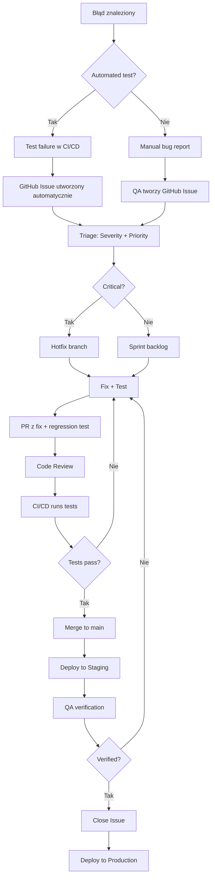

# Plan Testów - Foodnager

## Wprowadzenie i Cele Testowania

### Cel Dokumentu

Niniejszy dokument określa kompleksową strategię testowania dla aplikacji Foodnager - systemu zarządzania przepisami kulinarnymi z funkcjonalnościami wirtualnej lodówki, inteligentnego wyszukiwania przepisów oraz generowania przepisów przy użyciu AI.

### Cele Testowania

1. **Weryfikacja poprawności funkcjonalnej** - zapewnienie, że wszystkie funkcje systemu działają zgodnie z wymaganiami PRD
2. **Walidacja integracji** - potwierdzenie prawidłowej współpracy między komponentami frontendowymi, API endpoints, serwisami oraz zewnętrznymi usługami (Supabase, OpenRouter.ai, Spoonacular)
3. **Zapewnienie jakości UX** - weryfikacja responsywności, dostępności i intuicyjności interfejsu użytkownika
4. **Bezpieczeństwo** - potwierdzenie prawidłowego działania mechanizmów autentykacji, autoryzacji i ochrony danych
5. **Wydajność** - ocena wydajności aplikacji pod kątem czasów odpowiedzi API, renderingu komponentów i obsługi dużych zbiorów danych
6. **Stabilność** - identyfikacja i eliminacja regresji, memory leaks oraz innych problemów wpływających na stabilność

### Kontekst Projektu

- **Status**: MVP (Minimum Viable Product)
- **Stack technologiczny**: Astro 5, React 19, TypeScript 5, Tailwind 4, Shadcn/ui, Supabase, OpenRouter.ai
- **Architektura**: SSR (Server-Side Rendering) z Astro + dynamiczne komponenty React, RESTful API endpoints
- **Obecny stan testów**: Brak zautomatyzowanych testów jednostkowych i integracyjnych

---

## Zakres Testów

### Funkcjonalności Objęte Testami

#### 1. Moduł Autentykacji

- Rejestracja użytkownika
- Logowanie i wylogowanie
- Odzyskiwanie hasła (forgot/reset password)
- Ochrona tras (route protection) przez middleware
- Zarządzanie sesją użytkownika

#### 2. Moduł Wirtualnej Lodówki

- Dodawanie produktów do lodówki
- Edycja produktów (ilość, jednostka, data ważności)
- Usuwanie produktów
- Wyszukiwanie i filtrowanie produktów
- Sortowanie produktów
- Automatyczne podpowiadanie produktów (autocomplete)
- Walidacja dat ważności

#### 3. Moduł Przepisów

- Tworzenie przepisów użytkownika
- Edycja i usuwanie przepisów
- Przeglądanie listy przepisów
- Filtrowanie przepisów (po tagach, trudności, źródle)
- Sortowanie przepisów
- Wyświetlanie szczegółów przepisu

#### 4. Moduł Wyszukiwania Przepisów (Hierarchiczne - 3 Tier)

- **Tier 1**: Wyszukiwanie w przepisach użytkownika po składnikach z lodówki
- **Tier 2**: Wyszukiwanie w zewnętrznym API (Spoonacular) z fallbackiem
- **Tier 3**: Generowanie przepisów przez AI (OpenRouter.ai) z fallbackiem
- Obliczanie match score (procent dopasowania składników)
- Identyfikacja brakujących składników
- Timeout handling dla każdego tier
- Logika fallback między tierami

#### 5. Moduł Gotowania

- Potwierdzanie ugotowania przepisu
- Automatyczne odliczanie składników z lodówki (FIFO)
- Obsługa ręcznych konwersji dla nieznanych jednostek
- Walidacja wystarczającej ilości składników

#### 6. Moduł Historii Gotowania

- Wyświetlanie historii gotowania
- Filtrowanie historii (po przepisie, dacie)
- Paginacja
- Wyświetlanie stanu lodówki przed/po gotowaniu

#### 7. Moduł Listy Zakupów

- Generowanie listy zakupów na podstawie brakujących składników
- Edycja listy zakupów
- Oznaczanie produktów jako kupione
- Eksport listy

#### 8. Integracje Zewnętrzne

- Komunikacja z Supabase (Auth, Database)
- Integracja z OpenRouter.ai (generowanie przepisów)
- Integracja ze Spoonacular API (wyszukiwanie przepisów)
- Obsługa błędów API (timeouts, rate limits, błędy sieci)

### Funkcjonalności Wyłączone z Zakresu MVP

- Import przepisów z zewnętrznych URL
- Wsparcie dla multimediów (wideo)
- Funkcje społecznościowe (udostępnianie, komentarze)
- Email verification (opcjonalne dla MVP)
- Profil użytkownika ze statystykami

---

## Typy Testów do Przeprowadzenia

### 1. Testy Jednostkowe (Unit Tests)

**Framework**: Vitest (rekomendowany dla Vite-based projektów jak Astro)

**Zakres**:

- **Funkcje pomocnicze (Utils)**:
  - `src/lib/utils/match-score.calculator.ts` - obliczanie match score
  - `src/lib/utils/preferences-filter.ts` - filtrowanie preferencji
  - `src/lib/utils/recipe-utils.ts` - transformacje przepisów
  - `src/lib/utils/date-utils.ts` - operacje na datach
  - `src/lib/utils/ingredient-translator.ts` - tłumaczenie składników
  - `src/lib/utils/unit-converter.ts` - konwersje jednostek
- **Walidatory (Validation Schemas)**:
  - Wszystkie schematy Zod w `src/lib/validations/*`
  - Walidacja poprawnych i niepoprawnych danych wejściowych
- **Mappers**:
  - `src/lib/mappers/external-recipe-mapper.ts` - mapowanie przepisów z external API
  - `src/lib/mappers/recipe-mapper.ts` - transformacje DTO

- **Klasy Błędów**:
  - `src/lib/errors/index.ts` - poprawne tworzenie i propagacja błędów

- **AI Response Validator**:
  - `src/lib/services/ai/response-validator.ts` - walidacja odpowiedzi AI

**Metryki**:

- **Target coverage**: minimum 80% dla funkcji utils i mappers
- **Priorytet**: WYSOKI (podstawa dla innych testów)

### 2. Testy Integracyjne (Integration Tests)

**Framework**: Vitest + @supabase/supabase-js (mocked)

**Zakres**:

- **API Endpoints** (`src/pages/api/*`):
  - Testy wszystkich endpointów REST API
  - Walidacja request/response
  - Obsługa błędów (401, 404, 422, 500)
  - Middleware authentication flow
- **Services Layer** (`src/lib/services/*`):
  - `auth.service.ts` - rejestracja, logowanie, reset hasła
  - `fridge.service.ts` - CRUD operacje na lodówce
  - `recipe.service.ts` - CRUD operacje na przepisach
  - `recipe-discovery.service.ts` - hierarchiczne wyszukiwanie (3 tier)
  - `cooking-history.service.ts` - tworzenie historii i aktualizacja lodówki
  - `shopping-list.service.ts` - generowanie listy zakupów
  - `ai-recipe.service.ts` - generowanie przepisów przez AI
  - `external-api.service.ts` - integracja z Spoonacular

- **Database Operations**:
  - CRUD operacje z mockiem Supabase
  - Transakcje atomowe (np. gotowanie + aktualizacja lodówki)
  - RLS policies (Row Level Security) - weryfikacja uprawnień

**Podejście**:

- Mockowanie Supabase Client
- Mockowanie external API calls (OpenRouter, Spoonacular)
- Test fixtures dla typowych scenariuszy

**Metryki**:

- **Target coverage**: minimum 70% dla services
- **Priorytet**: WYSOKI (krytyczna logika biznesowa)

### 3. Testy Komponentów React (Component Tests)

**Framework**: Vitest + React Testing Library

**Zakres**:

- **Komponenty Autentykacji**:
  - `LoginForm.tsx`, `RegisterForm.tsx`, `ForgotPasswordForm.tsx`, `ResetPasswordForm.tsx`
  - Walidacja formularzy
  - Obsługa błędów
- **Komponenty Lodówki**:
  - `FridgeView.tsx` - główny widok z listą produktów
  - `AddProductModal.tsx`, `EditProductModal.tsx` - modalne formularze
  - `FridgeItem.tsx` - pojedynczy element listy
  - `ProductAutocomplete.tsx` - autocomplete produktów
- **Komponenty Przepisów**:
  - `RecipeListView.tsx` - lista przepisów
  - `RecipeFormModal.tsx` - formularz tworzenia/edycji przepisu
  - `RecipeCard.tsx` - karta przepisu
- **Komponenty Wyszukiwania Przepisów**:
  - `RecipeSearchView.tsx` - główny widok wyszukiwania
  - `SourceSelectionView.tsx` - wybór źródła wyszukiwania
  - `SearchResultsView.tsx` - wyniki wyszukiwania
  - `RecipeResultCard.tsx` - karta wyniku
- **Komponenty Szczegółów Przepisu**:
  - `RecipeDetailsView.tsx` - szczegółowy widok przepisu
  - `IngredientsList.tsx` - lista składników z availability status
  - `InstructionsSection.tsx` - instrukcje przygotowania
  - `ManualConversionModal.tsx` - modal ręcznej konwersji
- **Komponenty UI (Shadcn)**:
  - Podstawowe komponenty UI (Button, Dialog, Select, etc.)
  - Testy snapshot dla zachowania stylistyki

**Testowane Aspekty**:

- Renderowanie komponentów
- Interakcje użytkownika (kliknięcia, wpisywanie)
- Walidacja formularzy
- Stany loading/error/success
- Conditional rendering
- Props passing

**Metryki**:

- **Target coverage**: minimum 60% dla komponentów React
- **Priorytet**: ŚREDNI (ważne dla UX, ale niższy priorytet niż logika biznesowa)

### 4. Testy End-to-End (E2E Tests)

**Framework**: Playwright

**Zakres**:

- **User Journey: Nowy Użytkownik**:
  1. Rejestracja nowego konta
  2. Logowanie
  3. Dodanie pierwszego produktu do lodówki
  4. Wyszukanie przepisu po składnikach z lodówki
  5. Zapisanie przepisu z external API
  6. Ugotowanie przepisu (aktualizacja lodówki)
  7. Wyświetlenie historii gotowania
- **User Journey: Zarządzanie Przepisami**:
  1. Logowanie
  2. Utworzenie nowego przepisu użytkownika
  3. Edycja przepisu
  4. Wyszukiwanie przepisu w liście
  5. Usunięcie przepisu
- **User Journey: Wyszukiwanie Hierarchiczne**:
  1. Logowanie
  2. Dodanie składników do lodówki
  3. Wyszukiwanie przepisu - Tier 1 (user recipes)
  4. Wyszukiwanie przepisu - Tier 2 (external API)
  5. Wyszukiwanie przepisu - Tier 3 (AI generation)
  6. Zapisanie wygenerowanego przepisu AI
- **User Journey: Lista Zakupów**:
  1. Logowanie
  2. Wybranie przepisu
  3. Generowanie listy zakupów
  4. Edycja listy zakupów
  5. Oznaczanie produktów jako kupione

- **Cross-Browser Testing**:
  - Chrome, Firefox, Safari (WebKit)
  - Mobile viewports (responsive design)

**Metryki**:

- **Coverage**: wszystkie główne user journeys
- **Priorytet**: ŚREDNI (czasochłonne, ale krytyczne dla walidacji przepływów)

### 5. Testy Wydajnościowe (Performance Tests)

**Narzędzia**: Lighthouse CI, k6, Vitest benchmark

**Zakres**:

- **Frontend Performance**:
  - Lighthouse scores (Performance, Accessibility, Best Practices, SEO)
  - First Contentful Paint (FCP) < 1.5s
  - Largest Contentful Paint (LCP) < 2.5s
  - Total Blocking Time (TBT) < 200ms
  - Cumulative Layout Shift (CLS) < 0.1
- **API Response Times**:
  - GET endpoints < 200ms (database reads)
  - POST/PUT/DELETE endpoints < 500ms
  - Search endpoints < 1s (Tier 1)
  - External API calls respecting timeouts (Tier 2: 10s, Tier 3: 45s)
- **Database Performance**:
  - Query optimization dla złożonych joinów
  - Index utilization
  - N+1 query prevention
- **Load Testing**:
  - 100 concurrent users - wszystkie endpointy powinny odpowiadać w akceptowalnym czasie
  - Stress testing dla AI generation endpoint (rate limiting)

**Metryki**:

- **Target scores**: Lighthouse > 90 dla wszystkich metryk
- **Priorytet**: NISKI dla MVP (optymalizacja post-launch)

### 6. Testy Bezpieczeństwa (Security Tests)

**Narzędzia**: OWASP ZAP, Supabase Security Advisor

**Zakres**:

- **Authentication & Authorization**:
  - Próby dostępu do chronionych tras bez tokenu
  - Próby dostępu do zasobów innych użytkowników
  - Session hijacking prevention
  - CSRF protection
- **Input Validation**:
  - SQL Injection attempts (via Supabase - powinno być chronione)
  - XSS attempts w formularzach
  - Command injection w zewnętrznych API calls
- **Data Protection**:
  - Weryfikacja RLS policies w Supabase
  - Sprawdzenie czy wrażliwe dane nie są eksponowane w responses
  - Proper error handling (nie ujawnianie stack traces)
- **Rate Limiting**:
  - Testowanie rate limits dla kosztownych operacji (AI generation, external API calls)
  - Brute force protection dla logowania

**Metryki**:

- **Zero critical vulnerabilities** przed production
- **Priorytet**: WYSOKI (bezpieczeństwo fundamentalne)

### 7. Testy Regresji (Regression Tests)

**Podejście**: Automated test suite run po każdym deployment

**Zakres**:

- Wszystkie testy jednostkowe i integracyjne
- Smoke tests dla głównych funkcjonalności
- Visual regression tests (Percy lub Chromatic)

**Metryki**:

- **Execution time**: full suite < 15 minut
- **Priorytet**: WYSOKI (zapobieganie regresji)

### 8. Testy Dostępności (Accessibility Tests)

**Narzędzia**: axe-core, WAVE, manual WCAG audit

**Zakres**:

- **WCAG 2.1 Level AA Compliance**:
  - Kontrast kolorów
  - Keyboard navigation
  - Screen reader support (ARIA labels)
  - Focus management (focus trapping w modalach)
  - Alt text dla obrazów
- **Formularze**:
  - Proper label associations
  - Error messages dla screen readers
  - Required fields markup
- **Responsywność**:
  - Mobile-first design
  - Touch target sizes (min 44x44px)

**Metryki**:

- **Zero critical a11y issues** przed production
- **Priorytet**: ŚREDNI (ważne dla inkluzywności)

---

## Scenariusze Testowe dla Kluczowych Funkcjonalności

### TC-001: Rejestracja Nowego Użytkownika

**Typ**: Integration Test + E2E Test

**Przedwarunki**: Brak konta dla danego email

**Kroki**:

1. Użytkownik otwiera stronę `/register`
2. Wypełnia formularz:
   - Email: `test@example.com`
   - Hasło: `SecurePass123!`
3. Klikuje "Zarejestruj się"

**Oczekiwany rezultat**:

- Użytkownik zostaje utworzony w Supabase Auth
- Session zostaje utworzony
- Użytkownik jest przekierowany na `/fridge`
- Toast z sukcesem jest wyświetlony

**Przypadki brzegowe**:

- Email już istnieje → błąd 409 Conflict
- Hasło za słabe → błąd walidacji 422
- Brak połączenia z Supabase → błąd 500

---

### TC-002: Dodanie Produktu do Lodówki

**Typ**: Integration Test + Component Test + E2E Test

**Przedwarunki**: Użytkownik zalogowany

**Kroki**:

1. Użytkownik otwiera stronę `/fridge`
2. Klikuje przycisk "Dodaj produkt"
3. W modale wpisuje:
   - Produkt: "Pomidor" (autocomplete)
   - Ilość: 5
   - Jednostka: "sztuk"
   - Data ważności: 2025-12-31
4. Klikuje "Zapisz"

**Oczekiwany rezultat**:

- Produkt zostaje dodany do tabeli `user_products`
- Lista lodówki jest odświeżona (refetch)
- Nowy produkt jest widoczny na liście
- Modal zostaje zamknięty
- Toast z sukcesem jest wyświetlony

**Przypadki brzegowe**:

- Produkt już istnieje → pytanie o nadpisanie lub dodanie nowej pozycji
- Ilość ujemna → błąd walidacji
- Data ważności w przeszłości → ostrzeżenie
- Produkt nieistniejący → automatyczne utworzenie jako private product

---

### TC-003: Hierarchiczne Wyszukiwanie Przepisów (3 Tier)

**Typ**: Integration Test + E2E Test

**Przedwarunki**:

- Użytkownik zalogowany
- W lodówce są produkty: "Pomidor", "Mozzarella", "Bazylia"

**Kroki Tier 1 (User Recipes)**:

1. Użytkownik otwiera `/recipes/search`
2. Wybiera "Wszystkie źródła"
3. Klikta "Szukaj przepisów"
4. System wyszukuje w user recipes (Tier 1)

**Oczekiwany rezultat Tier 1**:

- Zapytanie do bazy danych po przepisy użytkownika
- Zwrócenie przepisów z match_score
- Jeśli match_score >= 70% → zwrócenie wyników
- Jeśli brak wyników → fallback do Tier 2

**Kroki Tier 2 (External API)**:

1. Brak wyników w Tier 1
2. System wykonuje zapytanie do Spoonacular API
3. Timeout: 10 sekund

**Oczekiwany rezultat Tier 2**:

- API zwraca przepisy zewnętrzne
- Top 3 przepisy są zapisywane do bazy jako `source='api'`
- Przepisy są mapowane przez `ExternalRecipeMapper`
- Zwrócenie przepisów z match_score
- Jeśli brak wyników lub timeout → fallback do Tier 3

**Kroki Tier 3 (AI Generation)**:

1. Brak wyników w Tier 2
2. System generuje prompt dla OpenRouter.ai
3. Wysyła zapytanie do Perplexity Sonar Pro
4. Timeout: 45 sekund

**Oczekiwany rezultat Tier 3**:

- AI generuje przepis na podstawie składników
- Przepis jest walidowany przez `AIResponseValidator`
- Przepis NIE jest automatycznie zapisany (save_to_recipes=false default)
- Użytkownik może zapisać przepis ręcznie
- Jeśli timeout → komunikat o błędzie

**Przypadki brzegowe**:

- Pusta lodówka → ostrzeżenie przed rozpoczęciem wyszukiwania
- Brak klucza Spoonacular API → pominięcie Tier 2
- Brak klucza OpenRouter API → pominięcie Tier 3
- Timeout w każdym tier → graceful fallback
- Błąd sieci → odpowiedni komunikat

---

### TC-004: Gotowanie Przepisu z Automatycznym Odliczaniem

**Typ**: Integration Test + E2E Test

**Przedwarunki**:

- Użytkownik zalogowany
- W lodówce:
  - Pomidor: 5 sztuk
  - Mozzarella: 200 g
  - Bazylia: 50 g
- Przepis wymaga:
  - Pomidor: 3 sztuk
  - Mozzarella: 150 g
  - Bazylia: 20 g

**Kroki**:

1. Użytkownik otwiera szczegóły przepisu
2. Sprawdza availability status składników (wszystkie "available")
3. Klikka "Gotuj"
4. Potwierdza w dialogu

**Oczekiwany rezultat**:

- Transakcja atomowa w Supabase:
  - Snapshot lodówki przed gotowaniem zapisany w `cooking_history.fridge_state_before`
  - Odliczenie składników z `user_products` (FIFO dla wielu pozycji)
  - Snapshot lodówki po gotowaniu zapisany w `cooking_history.fridge_state_after`
  - Utworzenie wpisu w `cooking_history`
- Użytkownik przekierowany na `/history`
- Toast z sukcesem
- Nowe stany w lodówce:
  - Pomidor: 2 sztuk
  - Mozzarella: 50 g
  - Bazylia: 30 g

**Przypadki brzegowe**:

- Niewystarczające składniki → błąd `INSUFFICIENT_INGREDIENTS` z detalami
- Składnik z nieznaną jednostką → modal ręcznej konwersji
- Błąd podczas transakcji → rollback, lodówka niezmieniona
- Przepis z temporary ID (AI, nie zapisany) → błąd, wymaga zapisu

---

### TC-005: Ręczna Konwersja Jednostek

**Typ**: Integration Test + Component Test

**Przedwarunki**:

- Użytkownik zalogowany
- W lodówce:
  - Cukier: 1 kg (1000 g)
- Przepis wymaga:
  - Cukier: 2 szklanki (jednostka nieznana)

**Kroki**:

1. Użytkownik otwiera szczegóły przepisu
2. System identyfikuje składnik z unknown availability status
3. Użytkownik klikka "Gotuj"
4. Wyświetlany jest modal `ManualConversionModal`
5. Użytkownik wpisuje: "2 szklanki = 400 g"
6. Potwierdza

**Oczekiwany rezultat**:

- Konwersja jest zapisana jako `manual_conversions` w `cooking_history`
- System przelicza dostępność: 1000g >= 400g → sufficient
- Gotowanie przebiega z odliczeniem 400g z lodówki
- Manual conversion nie jest zapisywana globalnie (tylko dla tego cooking event)

**Przypadki brzegowe**:

- Użytkownik wpisuje niepoprawną ilość (tekst zamiast liczby) → błąd walidacji
- Po konwersji wciąż brak wystarczających składników → błąd `INSUFFICIENT_INGREDIENTS`

---

### TC-006: Generowanie Listy Zakupów

**Typ**: Integration Test + Component Test

**Przedwarunki**:

- Użytkownik zalogowany
- W lodówce:
  - Pomidor: 2 sztuk
- Przepis wymaga:
  - Pomidor: 5 sztuk
  - Mozzarella: 200 g
  - Bazylia: 30 g

**Kroki**:

1. Użytkownik otwiera szczegóły przepisu
2. Klikka "Lista zakupów"
3. System identyfikuje brakujące składniki

**Oczekiwany rezultat**:

- Modal `ShoppingListModal` wyświetla:
  - Pomidor: 3 sztuk (brakuje)
  - Mozzarella: 200 g (brakuje)
  - Bazylia: 30 g (brakuje)
- Użytkownik może edytować listę
- Użytkownik może zaznaczyć produkty jako kupione
- Lista jest zapisana tymczasowo (local state, bez persystencji w MVP)

**Przypadki brzegowe**:

- Wszystkie składniki dostępne → komunikat "Masz wszystkie składniki"
- Pusta lodówka → całe zapotrzebowanie na liście

---

### TC-007: Obsługa Timeoutów w Wyszukiwaniu

**Typ**: Integration Test

**Przedwarunki**: Mock zewnętrznych API z długimi response times

**Scenariusz Tier 2 Timeout**:

1. User wyszukuje przepisy
2. Tier 1 zwraca brak wyników
3. Tier 2 (Spoonacular) timeout po 10 sekundach
4. System automatycznie fallback do Tier 3

**Oczekiwany rezultat**:

- Użytkownik widzi komunikat: "Wyszukiwanie w zewnętrznym API przekroczyło limit czasu, próbuję AI..."
- Tier 3 (AI) jest wywoływany
- Search metadata zawiera informację o timeout w Tier 2

**Scenariusz Tier 3 Timeout**:

1. Tier 1 i Tier 2 bez wyników
2. Tier 3 (AI) timeout po 45 sekundach
3. Brak dalszych fallbacks

**Oczekiwany rezultat**:

- Komunikat: "Nie udało się znaleźć przepisów. Spróbuj ponownie."
- Użytkownik może retry search
- Error handling nie crashuje aplikacji

---

### TC-008: Filtrowanie i Sortowanie Przepisów

**Typ**: Component Test + Integration Test

**Przedwarunki**:

- Użytkownik zalogowany
- W bazie 20 przepisów o różnych tagach, trudnościach i źródłach

**Kroki**:

1. Użytkownik otwiera `/recipes`
2. Wybiera filtry:
   - Tagi: "Vegan", "Quick"
   - Trudność: "Easy"
   - Źródło: "User"
3. Wybiera sortowanie: "Cooking time (asc)"

**Oczekiwany rezultat**:

- API endpoint `/api/recipes` jest wywoływane z query params:
  ```
  ?tags=vegan,quick&difficulty=easy&source=user&sort=cooking_time&order=asc
  ```
- Zwrócona lista przepisów spełnia wszystkie filtry
- Przepisy są posortowane rosnąco po cooking_time
- UI zaktualizowany z nowymi wynikami

**Przypadki brzegowe**:

- Filtry nie zwracają wyników → komunikat "Brak przepisów"
- Zbyt wiele filtrów → wolniejsze zapytanie, ale poprawne wyniki

---

### TC-009: Edycja Produktu w Lodówce

**Typ**: Component Test + Integration Test

**Przedwarunki**:

- Użytkownik zalogowany
- Produkt w lodówce: "Pomidor, 5 sztuk, 2025-12-31"

**Kroki**:

1. Użytkownik otwiera `/fridge`
2. Klikka ikonę edycji przy produkcie
3. W modale zmienia:
   - Ilość: 10
   - Data ważności: 2025-12-15
4. Klikka "Zapisz"

**Oczekiwany rezultat**:

- API endpoint `PUT /api/fridge/{id}` jest wywoływane
- Produkt w `user_products` jest aktualizowany
- Lista lodówki jest odświeżona
- Toast z sukcesem

**Przypadki brzegowe**:

- Zmiana ilości na 0 → pytanie o usunięcie produktu
- Zmiana daty na przeszłą → ostrzeżenie
- Konflikt (produkt usunięty przez inną sesję) → błąd 404

---

### TC-010: Usuwanie Przepisu

**Typ**: Component Test + Integration Test + E2E Test

**Przedwarunki**:

- Użytkownik zalogowany
- Użytkownik posiada przepis ID=123

**Kroki**:

1. Użytkownik otwiera szczegóły przepisu 123
2. Klikka menu "..." → "Usuń"
3. Potwierdza w dialogu

**Oczekiwany rezultat**:

- API endpoint `DELETE /api/recipes/123` jest wywoływane
- Przepis jest usuwany z bazy (cascade delete dla ingredients, tags)
- Użytkownik przekierowany na `/recipes`
- Toast z sukcesem

**Przypadki brzegowe**:

- Przepis nie należy do użytkownika → błąd 403 Forbidden
- Przepis już nie istnieje → błąd 404 Not Found
- Przepis używany w cooking_history → pytanie o potwierdzenie (cooking_history pozostaje)

---

## Środowisko Testowe

### Środowiska

#### 1. Lokalne (Development)

- **Cel**: Development i debugging
- **Stack**: Local Astro dev server (`npm run dev`), local Supabase (opcjonalnie via Docker)
- **Dane**: Test fixtures, mock data
- **External APIs**: Mocked (MSW - Mock Service Worker)

#### 2. CI/CD (GitHub Actions)

- **Cel**: Automated testing przy każdym push/PR
- **Stack**: GitHub Actions runners, Supabase test instance
- **Dane**: Seed data z migracji
- **External APIs**: Mocked

#### 3. Staging

- **Cel**: Pre-production testing
- **Stack**: DigitalOcean droplet, Supabase staging project
- **Dane**: Anonimizowane dane produkcyjne lub synthetic data
- **External APIs**: Real APIs (z test keys)

#### 4. Production

- **Cel**: Live application
- **Stack**: DigitalOcean production, Supabase production project
- **Dane**: Real user data
- **External APIs**: Real APIs (z production keys)

### Konfiguracja Środowiska

#### Zmienne Środowiskowe (per environment)

```bash
# Supabase
SUPABASE_URL=https://xxx.supabase.co
SUPABASE_KEY=eyJxxx...

# Spoonacular (opcjonalne)
EXTERNAL_RECIPE_API_URL=https://api.spoonacular.com
EXTERNAL_RECIPE_API_KEY=xxx

# OpenRouter
OPENROUTER_API_KEY=sk-or-v1-xxx
OPENROUTER_MODEL=perplexity/sonar-pro

# Timeouts
TIER2_TIMEOUT_MS=10000
TIER3_TIMEOUT_MS=45000

# Test-specific
TEST_MODE=true
MOCK_EXTERNAL_APIS=true
```

#### Test Database

- Dedykowana Supabase test project dla CI/CD
- Automatyczne migracje przed każdym test run
- Seed data z `supabase/migrations/*_seed_*.sql`
- Reset między test suites (truncate tables)

---

## Narzędzia do Testowania

### Framework i Biblioteki

| Typ Testu           | Narzędzie                      | Wersja          | Uzasadnienie                              |
| ------------------- | ------------------------------ | --------------- | ----------------------------------------- |
| Unit Tests          | Vitest                         | ^2.0.0          | Szybki, Vite-native, kompatybilny z Astro |
| Integration Tests   | Vitest + MSW                   | ^2.0.0, ^2.0.0  | Mockowanie HTTP requests, szybkie         |
| Component Tests     | Vitest + React Testing Library | ^2.0.0, ^16.0.0 | De facto standard dla React               |
| E2E Tests           | Playwright                     | ^1.45.0         | Cross-browser, szybki, developer-friendly |
| Performance Tests   | Lighthouse CI                  | ^0.14.0         | Automated Lighthouse audits               |
| Load Tests          | k6                             | ^0.50.0         | Modern load testing tool                  |
| Security Tests      | OWASP ZAP                      | Latest          | Automated security scanning               |
| Accessibility Tests | axe-core                       | ^4.9.0          | Integrated z React Testing Library        |
| Visual Regression   | Percy (opcjonalnie)            | -               | Screenshot comparisons                    |
| API Testing         | Vitest + Supertest             | ^2.0.0, ^7.0.0  | HTTP assertions                           |

### Dodatkowe Narzędzia

- **Code Coverage**: `c8` (built-in Vitest)
- **Mocking**: MSW (Mock Service Worker) dla API calls
- **Test Data Factory**: `@faker-js/faker` dla generowania danych
- **Database Mocking**: `@supabase/supabase-js` z manual mocks
- **CI/CD**: GitHub Actions
- **Test Reporting**: Vitest UI, Playwright HTML Report

### Instalacja

```bash
# Test dependencies
npm install -D vitest @vitest/ui @vitest/coverage-c8
npm install -D @testing-library/react @testing-library/jest-dom @testing-library/user-event
npm install -D @playwright/test
npm install -D msw
npm install -D @faker-js/faker
npm install -D supertest
npm install -D axe-core @axe-core/react
```

---

## Harmonogram Testów

### Faza 1: Fundamenty (Tydzień 1-2)

**Cel**: Zbudowanie fundamentów test infrastructure

**Zadania**:

1. Setup Vitest configuration
2. Setup Playwright configuration
3. Setup MSW dla mockowania API
4. Utworzenie test fixtures i helpers
5. Napisanie pierwszych 10 unit tests dla utils
6. Setup CI/CD pipeline w GitHub Actions

**Deliverables**:

- `vitest.config.ts`
- `playwright.config.ts`
- `tests/setup.ts`
- `tests/fixtures/*`
- `tests/utils/*.test.ts` (10 tests)
- `.github/workflows/test.yml`

**KPI**:

- ✅ CI/CD pipeline działa
- ✅ Wszystkie testy przechodzą

---

### Faza 2: Testy Jednostkowe i Walidacyjne (Tydzień 3-4)

**Cel**: Pokrycie testami unit wszystkich utils, validators i mappers

**Zadania**:

1. Testy dla wszystkich utils w `src/lib/utils/*` (17 plików)
2. Testy dla wszystkich validations schemas w `src/lib/validations/*` (8 plików)
3. Testy dla mappers w `src/lib/mappers/*` (3 pliki)
4. Testy dla custom errors w `src/lib/errors/*`

**Deliverables**:

- `tests/utils/*.test.ts` (17 suites)
- `tests/validations/*.test.ts` (8 suites)
- `tests/mappers/*.test.ts` (3 suites)
- `tests/errors/*.test.ts` (1 suite)

**KPI**:

- ✅ Min. 80% code coverage dla utils
- ✅ Min. 90% code coverage dla validations
- ✅ Wszystkie edge cases pokryte

---

### Faza 3: Testy Integracyjne API (Tydzień 5-7)

**Cel**: Pokrycie testami integracyjnymi wszystkich API endpoints

**Zadania**:

1. Setup Supabase mocking strategy
2. Testy dla auth endpoints (`src/pages/api/auth/*`)
3. Testy dla fridge endpoints (`src/pages/api/fridge/*`)
4. Testy dla recipes endpoints (`src/pages/api/recipes/*`)
5. Testy dla cooking-history endpoints
6. Testy dla shopping-list, tags, units endpoints

**Deliverables**:

- `tests/api/auth/*.test.ts` (7 suites)
- `tests/api/fridge/*.test.ts` (3 suites)
- `tests/api/recipes/*.test.ts` (5 suites)
- `tests/api/cooking-history/*.test.ts` (1 suite)
- `tests/api/shopping-list/*.test.ts` (1 suite)
- `tests/api/dictionaries/*.test.ts` (2 suites)

**KPI**:

- ✅ Min. 70% code coverage dla API endpoints
- ✅ Wszystkie happy paths i error paths pokryte
- ✅ Authentication middleware testowany

---

### Faza 4: Testy Services Layer (Tydzień 8-10)

**Cel**: Pokrycie testami integracyjnymi wszystkich services

**Zadania**:

1. Testy dla `auth.service.ts`
2. Testy dla `fridge.service.ts`
3. Testy dla `recipe.service.ts`
4. Testy dla `recipe-discovery.service.ts` (hierarchical search - krytyczne!)
5. Testy dla `cooking-history.service.ts` (transakcje atomowe - krytyczne!)
6. Testy dla `ai-recipe.service.ts`
7. Testy dla `external-api.service.ts`
8. Testy dla `shopping-list.service.ts`

**Deliverables**:

- `tests/services/*.test.ts` (11 suites)

**KPI**:

- ✅ Min. 75% code coverage dla services
- ✅ Wszystkie business logic paths pokryte
- ✅ Error handling i edge cases przetestowane

---

### Faza 5: Testy Komponentów React (Tydzień 11-13)

**Cel**: Pokrycie testami głównych komponentów React

**Zadania**:

1. Testy dla auth components (4 komponenty)
2. Testy dla fridge components (11 komponentów)
3. Testy dla recipes components (15 komponentów)
4. Testy dla recipe-search components (15 komponentów)
5. Testy dla recipe-details components (20 komponentów)
6. Testy dla cooking-history components (10 komponentów)
7. Testy dla shopping-list components (7 komponentów)

**Deliverables**:

- `tests/components/**/*.test.tsx` (82 suites)

**KPI**:

- ✅ Min. 60% code coverage dla komponentów
- ✅ Wszystkie interactive flows przetestowane
- ✅ Accessibility checks w każdym teście

---

### Faza 6: Testy E2E (Tydzień 14-16)

**Cel**: Walidacja głównych user journeys

**Zadania**:

1. Setup Playwright z test users i database seeding
2. E2E test: Rejestracja i pierwsze logowanie
3. E2E test: Zarządzanie lodówką (CRUD)
4. E2E test: Tworzenie i edycja przepisów
5. E2E test: Hierarchiczne wyszukiwanie przepisów (3 tier)
6. E2E test: Gotowanie przepisu z aktualizacją lodówki
7. E2E test: Lista zakupów
8. E2E test: Historia gotowania

**Deliverables**:

- `e2e/*.spec.ts` (8 głównych scenarios)
- `e2e/fixtures/*` (test data)
- `e2e/helpers/*` (page objects)

**KPI**:

- ✅ Wszystkie główne user journeys pokryte
- ✅ Testy przechodzą w Chrome, Firefox, Safari
- ✅ Testy przechodzą w mobile viewport

---

### Faza 7: Testy Bezpieczeństwa i Wydajności (Tydzień 17-18)

**Cel**: Audyt bezpieczeństwa i wydajności

**Zadania**:

1. OWASP ZAP automated scan
2. Manual security audit (OWASP Top 10)
3. Lighthouse CI setup i baseline
4. Load testing z k6 (100 concurrent users)
5. Database query optimization
6. Frontend performance optimization

**Deliverables**:

- Security audit report
- Performance audit report
- `k6/load-tests/*.js` (load test scenarios)
- `.github/workflows/lighthouse.yml`

**KPI**:

- ✅ Zero critical security vulnerabilities
- ✅ Lighthouse scores > 90
- ✅ API response times < benchmarks

---

### Faza 8: Continuous Testing i Monitoring (Tydzień 19+)

**Cel**: Utrzymanie jakości post-launch

**Zadania**:

1. Setup test execution w CI/CD (on push, on PR)
2. Setup scheduled test runs (nightly full suite)
3. Setup visual regression tests (Percy/Chromatic)
4. Setup error monitoring (Sentry)
5. Setup performance monitoring (Lighthouse CI + RUM)
6. Documentation dla test maintenance

**Deliverables**:

- `.github/workflows/tests.yml` (comprehensive)
- `.github/workflows/nightly-tests.yml`
- `docs/TESTING.md` (testing guide)

**KPI**:

- ✅ CI/CD execution time < 15 minut
- ✅ Test flakiness < 1%
- ✅ Test maintenance documented

---

## Kryteria Akceptacji Testów

### Poziom Testy Jednostkowe

- ✅ **Minimum 80% code coverage** dla utils, mappers, validators
- ✅ **Zero failing tests** w CI/CD
- ✅ **Execution time** < 30 sekund dla full suite

### Poziom Testy Integracyjne

- ✅ **Minimum 70% code coverage** dla services i API endpoints
- ✅ **Wszystkie happy paths** pokryte
- ✅ **Wszystkie główne error paths** pokryte (401, 404, 422, 500)
- ✅ **Zero failing tests** w CI/CD
- ✅ **Execution time** < 2 minuty dla full suite

### Poziom Testy Komponentów

- ✅ **Minimum 60% code coverage** dla React components
- ✅ **Wszystkie interactive flows** przetestowane
- ✅ **Accessibility checks** included w każdym teście
- ✅ **Zero failing tests** w CI/CD

### Poziom Testy E2E

- ✅ **Wszystkie główne user journeys** (8) pokryte
- ✅ **Cross-browser compatibility** (Chrome, Firefox, Safari)
- ✅ **Mobile responsiveness** validated
- ✅ **Zero critical bugs** found
- ✅ **Execution time** < 10 minut dla full suite

### Poziom Bezpieczeństwo

- ✅ **Zero critical vulnerabilities** (CVSS >= 7.0)
- ✅ **Zero high vulnerabilities** (CVSS >= 4.0) before production
- ✅ **All auth flows** secure (no token leaks, proper session management)
- ✅ **RLS policies** verified in Supabase

### Poziom Wydajność

- ✅ **Lighthouse Performance** score >= 90
- ✅ **Lighthouse Accessibility** score >= 90
- ✅ **LCP** < 2.5s
- ✅ **FCP** < 1.5s
- ✅ **TBT** < 200ms
- ✅ **API response times** within benchmarks

### Poziom Accessibility

- ✅ **Zero critical a11y issues** (axe-core)
- ✅ **WCAG 2.1 Level AA** compliance
- ✅ **Keyboard navigation** functional
- ✅ **Screen reader** support verified

### Definition of Done dla Test Suite

- ✅ Wszystkie fazy harmonogramu ukończone
- ✅ Wszystkie kryteria akceptacji spełnione
- ✅ CI/CD pipeline w pełni zautomatyzowany
- ✅ Test documentation complete
- ✅ Team trained on test execution and maintenance

---

## Role i Odpowiedzialności w Procesie Testowania

### QA Engineer (Lead)

**Odpowiedzialności**:

- Projektowanie strategii testowania
- Tworzenie i utrzymanie test plans
- Review test scenarios i test cases
- Koordynacja test execution
- Raportowanie wyników testów
- Zarządzanie bug tracking
- Test automation oversight

**Wymagane umiejętności**:

- Doświadczenie z Vitest/Jest, React Testing Library, Playwright
- Znajomość TypeScript
- Doświadczenie z CI/CD (GitHub Actions)

---

### Frontend Developer

**Odpowiedzialności**:

- Pisanie unit tests dla utils i helpers
- Pisanie component tests dla React components
- Fixing bugs znalezionych w testach
- Code review dla test code
- Maintaining test fixtures

**Wymagane umiejętności**:

- TypeScript, React, Vitest, React Testing Library
- Znajomość testing best practices

---

### Backend Developer

**Odpowiedzialności**:

- Pisanie integration tests dla API endpoints
- Pisanie unit tests dla services layer
- Mockowanie Supabase client
- Fixing bugs w API
- Optymalizacja wydajności queries

**Wymagane umiejętności**:

- TypeScript, Node.js, Astro, Supabase
- Znajomość RESTful API testing
- SQL optimization

---

### DevOps Engineer

**Odpowiedzialności**:

- Setup CI/CD pipelines dla testów
- Konfiguracja test environments (Staging)
- Automatyzacja test execution
- Monitoring test performance
- Setup Lighthouse CI, k6 load tests

**Wymagane umiejętności**:

- GitHub Actions, Docker, DigitalOcean
- CI/CD best practices
- Infrastructure as Code

---

### Security Specialist (Consultant)

**Odpowiedzialności**:

- Przeprowadzenie security audit
- Analiza OWASP ZAP reports
- Review auth implementation
- Penetration testing (manual)
- Rekomendacje security improvements

**Wymagane umiejętności**:

- OWASP Top 10
- Web application security
- Supabase security best practices

---

### Product Owner

**Odpowiedzialności**:

- Definiowanie priorytetów testowania
- Akceptacja test scenarios
- Decision making dla bug severity
- Sign-off na test completion

**Wymagane umiejętności**:

- Znajomość product requirements
- Understanding of QA process

---

## Procedury Raportowania Błędów

### Workflow Raportowania



### Szablon GitHub Issue dla Błędu

```markdown
## 🐛 Bug Report

### Opis Błędu

Krótki, jasny opis problemu.

### Severity

- [ ] Critical - blokuje główną funkcjonalność, brak workaround
- [ ] High - poważny problem, istnieje workaround
- [ ] Medium - problem zauważalny, nie blokujący
- [ ] Low - kosmetyczny, niski impact

### Priority

- [ ] P0 - Hotfix natychmiast
- [ ] P1 - Fix w obecnym sprint
- [ ] P2 - Fix w następnym sprint
- [ ] P3 - Backlog

### Kroki do Reprodukcji

1. Otwórz stronę X
2. Kliknij Y
3. Wpisz Z
4. Zaobserwuj błąd

### Oczekiwane Zachowanie

Co powinno się wydarzyć?

### Aktualne Zachowanie

Co się dzieje zamiast tego?

### Screenshot/Video

Załącz screenshot lub video jeśli możliwe.

### Środowisko

- Browser: Chrome 120
- OS: Windows 11
- Environment: Production / Staging / Local
- User role: Admin / User

### Dodatkowe Informacje

- Console errors:
- Network errors:
- Related issues:

### Proposed Solution (opcjonalnie)

Sugestia jak naprawić problem.

---

**Labels**: `bug`, `severity:X`, `priority:PX`, `module:X`
**Assignee**: @developer
**Milestone**: Sprint X
```

---

### Klasyfikacja Severity

| Severity     | Definicja                                                                       | Przykład                                                                              | SLA Resolution |
| ------------ | ------------------------------------------------------------------------------- | ------------------------------------------------------------------------------------- | -------------- |
| **Critical** | Blokuje główną funkcjonalność, brak workaround, dotyczy wszystkich użytkowników | Nie można się zalogować, baza danych down                                             | 4 godziny      |
| **High**     | Poważny problem wpływający na główną funkcjonalność, istnieje workaround        | Gotowanie przepisu nie odlicza składników (można ręcznie), search timeout zbyt krótki | 24 godziny     |
| **Medium**   | Zauważalny problem, nie blokujący głównych funkcji                              | Błędne sortowanie w liście, toast nie znika automatycznie                             | 1 tydzień      |
| **Low**      | Kosmetyczny problem, minimalny impact                                           | Literówka w UI, minor styling issue                                                   | 1 miesiąc      |

---

### Klasyfikacja Priority

| Priority | Definicja                  | Action                          |
| -------- | -------------------------- | ------------------------------- |
| **P0**   | Krytyczny bug w production | Hotfix natychmiast, deploy ASAP |
| **P1**   | Wysoki priorytet           | Fix w obecnym sprint            |
| **P2**   | Średni priorytet           | Fix w następnym sprint          |
| **P3**   | Niski priorytet            | Backlog, fix when possible      |

---

### Test Failure Notifications

**CI/CD Test Failures**:

- GitHub Actions failure → automatyczna notyfikacja do team Slack channel
- Playwright test failure → screenshot + video attachment w GitHub Actions artifacts
- Coverage drop → PR comment z delta coverage

**E2E Test Failures**:

- Email alert do QA Lead
- Playwright trace viewer link w artifacts

**Regression Detection**:

- Automatyczne utworzenie GitHub Issue z label `regression`
- Assignee: ostatni developer który modyfikował dany kod

---

### Bug Fix Verification Process

1. **Developer Fix**:
   - Naprawia bug w feature branch
   - Dodaje regression test (jeśli brak)
   - Pushuje PR z fix

2. **Automated Tests**:
   - CI/CD uruchamia full test suite
   - Sprawdza czy new regression test passes
   - Sprawdza czy nie wprowadzono nowych regresji

3. **Code Review**:
   - Inny developer review code + tests
   - QA Engineer review test coverage dla bug

4. **QA Verification**:
   - Deploy do Staging
   - QA Engineer manualnie weryfikuje fix
   - Sprawdza original bug + related scenarios

5. **Sign-off**:
   - QA Engineer zamyka GitHub Issue z komentarzem
   - Issue jest linkowane do PR

6. **Deploy to Production**:
   - Merge to main
   - Automated deployment
   - Post-deployment smoke tests

---

### Metryki Jakości

**Tracking w GitHub Projects**:

| Metryka                      | Target             | Tracking                                  |
| ---------------------------- | ------------------ | ----------------------------------------- |
| **Open Bugs**                | < 20               | GitHub Issues z label `bug`               |
| **Critical Bugs**            | 0                  | GitHub Issues z label `severity:critical` |
| **Average Resolution Time**  | < 3 dni            | GitHub Issue lifecycle                    |
| **Test Success Rate**        | > 95%              | CI/CD history                             |
| **Code Coverage**            | > 75%              | Codecov reports                           |
| **E2E Test Pass Rate**       | > 90%              | Playwright reports                        |
| **Security Vulnerabilities** | 0 critical, 0 high | OWASP ZAP reports                         |

**Weekly Report Template**:

```markdown
## QA Weekly Report - Week X

### Test Execution

- Unit tests: X passed / Y failed
- Integration tests: X passed / Y failed
- E2E tests: X passed / Y failed

### Bug Summary

- New bugs: X
- Fixed bugs: Y
- Open bugs: Z
  - Critical: A
  - High: B
  - Medium: C
  - Low: D

### Code Coverage

- Overall: X%
- Delta from last week: +/-Y%

### Blockers

- List of critical issues blocking progress

### Next Week Focus

- Planned testing activities
```

---

## Podsumowanie i Rekomendacje

### Kluczowe Zalecenia

1. **Priorytet 1: Rozpocznij od Infrastructure**
   - Setup Vitest, Playwright, MSW w pierwszym tygodniu
   - Bez solidnej infrastruktury testowej, pisanie testów będzie trudne i czasochłonne

2. **Priorytet 2: Focus na Business Logic**
   - Services layer (`recipe-discovery.service.ts`, `cooking-history.service.ts`) są krytyczne
   - Te komponenty zawierają największe ryzyko błędów logicznych

3. **Priorytet 3: Nie zaniedbuj Security**
   - Auth flow i RLS policies muszą być przetestowane przed production
   - Security audit powinien być przeprowadzony w Fazie 7

4. **Continuous Testing od Początku**
   - CI/CD pipeline powinien uruchamiać testy przy każdym push
   - Test failures powinny blokować merge do main

5. **Documentation is Key**
   - Dokumentuj test scenarios, fixtures, helpers
   - Onboarding nowych developerów będzie znacznie łatwiejszy

### Ryzyka i Mitigacje

| Ryzyko                                   | Prawdopodobieństwo | Impact  | Mitigacja                                                           |
| ---------------------------------------- | ------------------ | ------- | ------------------------------------------------------------------- |
| **Brak czasu na pełne pokrycie testami** | Wysokie            | Wysokie | Priorytetyzacja: zacząć od krytycznych services i API endpoints     |
| **Flaky E2E tests**                      | Średnie            | Średnie | Używać Playwright best practices (proper waiters, stable selectors) |
| **Mocking complexity**                   | Średnie            | Średnie | Używać MSW dla HTTP, simple mocks dla Supabase                      |
| **Test maintenance overhead**            | Średnie            | Niskie  | Keep tests simple, use page objects dla E2E                         |
| **External API dependencies**            | Niskie             | Średnie | Zawsze mockować external APIs w testach (Spoonacular, OpenRouter)   |

### Roadmap Post-MVP

Po osiągnięciu MVP i pełnego pokrycia testami, następne kroki:

1. **Visual Regression Tests**: Setup Percy lub Chromatic dla UI regression detection
2. **Mutation Testing**: Użycie Stryker.js dla weryfikacji jakości testów
3. **Contract Testing**: Jeśli Supabase API się zmieni, contract tests wykryją breaking changes
4. **Chaos Engineering**: Testowanie odporności na failures (network issues, database timeouts)
5. **Advanced Performance**: Real User Monitoring (RUM), distributed tracing

---

## Załączniki

### Użyteczne Linki

- [Vitest Documentation](https://vitest.dev/)
- [React Testing Library](https://testing-library.com/react)
- [Playwright Documentation](https://playwright.dev/)
- [MSW Documentation](https://mswjs.io/)
- [Supabase Testing Guide](https://supabase.com/docs/guides/testing)
- [OWASP Top 10](https://owasp.org/www-project-top-ten/)
- [Web.dev Performance](https://web.dev/performance/)

### Przykładowe Test Files

Zobacz przykładowe testy w dokumentacji:

- `docs/examples/utils.test.ts` - przykład unit test dla utils
- `docs/examples/api.test.ts` - przykład integration test dla API endpoint
- `docs/examples/component.test.tsx` - przykład component test
- `docs/examples/e2e.spec.ts` - przykład E2E test z Playwright

---

**Dokument przygotowany**: 2025-11-19  
**Wersja**: 1.0  
**Status**: Draft - do review  
**Autor**: AI QA Engineer  
**Reviewer**: TBD
